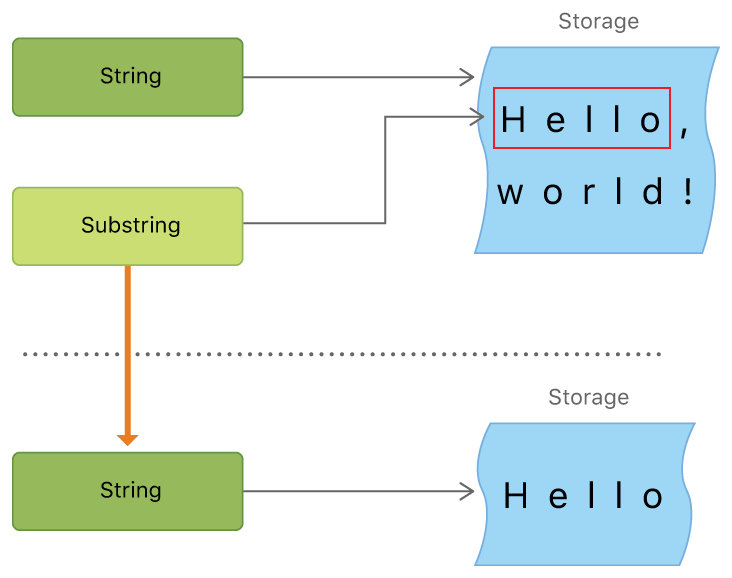
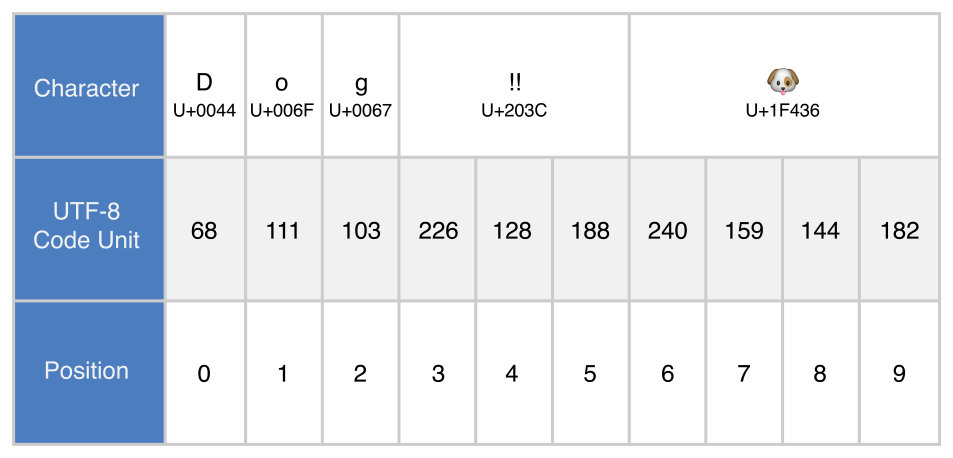
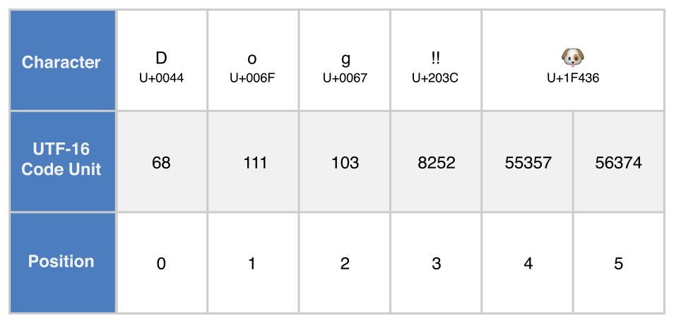
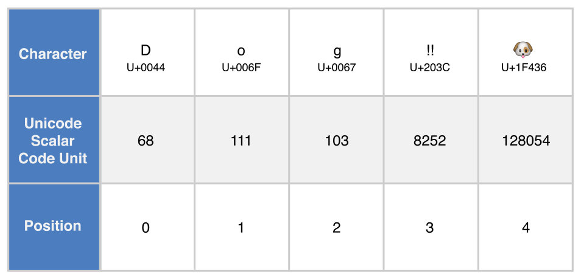
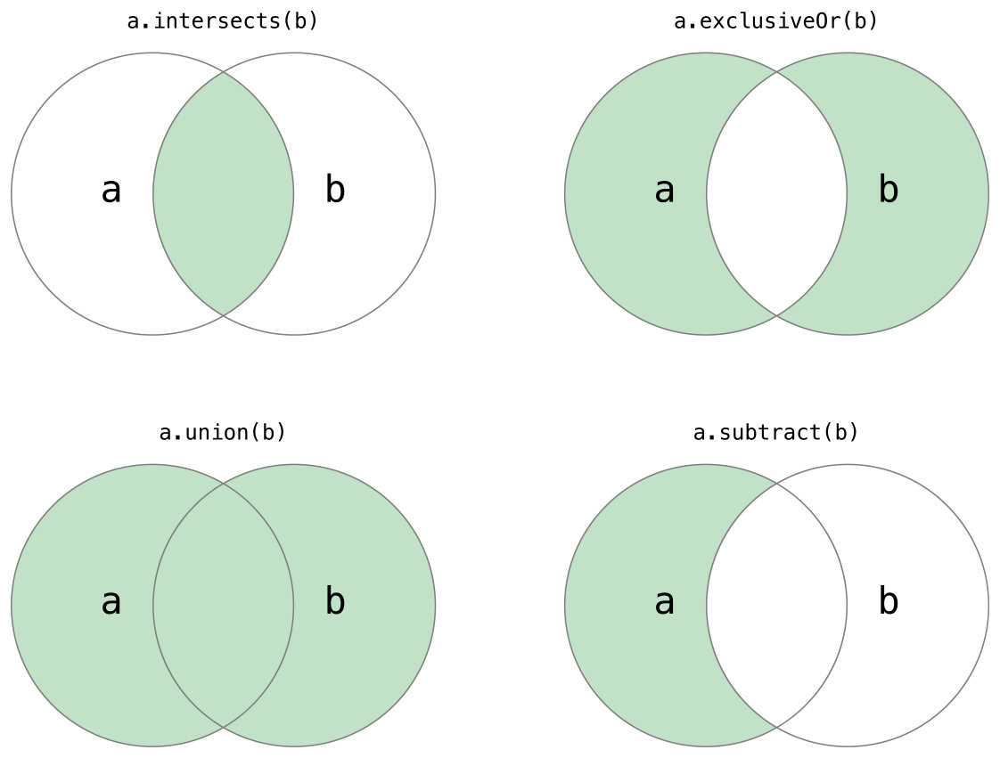
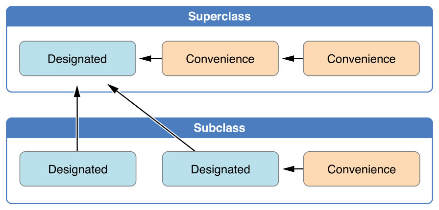
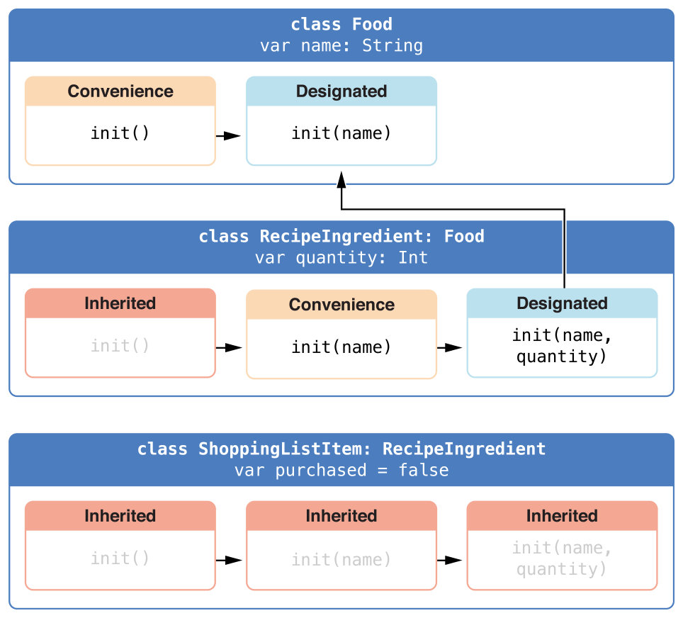
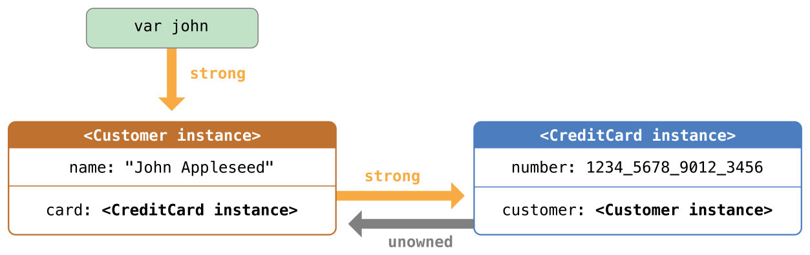

# ObjectiveC to Swift learning


## 字符串和字符

### 字符串是值类型
String值在传递给方法或者函数的时候会被复制过去，还有赋值给常量或者变量的时候也是一样。每一次赋值和传递，现存的 String值都会被复制一次，传递走的是拷贝而不是原本。

另一方面，Swift 编译器优化了字符串使用的资源，实际上拷贝只会在确实需要的时候才进行。

### String和Character类型是完全Unicode兼容的

每一个字符或字符串都是由 Unicode 字符的独立编码组成，并且提供了多种 Unicode 表示下访问这些字符的支持。
### 子字符串
字符串与子字符串的不同之处在于，作为性能上的优化，子字符串可以重用一部分用来保存原字符串的内存，或者是用来保存其他子字符串的内存。（字符串也拥有类似的优化，但是如果两个字符串使用相同的内存，他们就是等价的。）这个性能优化意味着在你修改字符串或者子字符串之前都不需要花费拷贝内存的代价。如同上面所说的，子字符串并不适合长期保存——因为它们重用了原字符串的内存，只要这个字符串有子字符串在使用中，那么这个字符串就必须一直保存在内存里。

```swift
let greeting = "Hello, world!"
let index = greeting.index(of: ",") ?? greeting.endIndex
let beginning = greeting[..<index]
// beginning is "Hello"
 
// Convert the result to a String for long-term storage.
let newString = String(beginning)
```



### Unicode标量和码元

Swift 的原生 String 类型建立于 Unicode 标量值之上。一个 Unicode 标量是一个为字符或者修饰符创建的独一无二的21位数字，比如 LATIN SMALL LETTER A (" a")的 U+0061 ，或者 FRONT-FACING BABY CHICK  ( "?" )的 U+1F425 。任意的 Unicode 标量，写作 \u{n}，里边的 n是一个 1-8 个与合法 Unicode 码位相等的16进制数字。

扩展字形集群是一个或者多个有序的 Unicode 标量（当组合起来时）产生的单个人类可读字符。

这有个栗子。字母 é以单个 Unicode 标量 é ( LATIN SMALL LETTER E WITH ACUTE, 或者 U+00E9)表示。总之，同样的字母也可以用一对标量——一个标准的字母 e ( LATIN SMALL LETTER E,或者说  U+0065)，以及 COMBINING ACUTE ACCENT标量( U+0301)表示。 COMBINING ACUTE ACCENT标量会以图形方式应用到它前边的标量上，当 Unicode 文本渲染系统渲染时，就会把 e转换为 é来输出。

当一个 Unicode 字符串写入文本文档或者其他储存里边的时候，这个字符串的 Unicode 标量会被编码为一个或者一系列 Unicode 定义的编码格式。每一种格式都把字符串编码成所谓码元的小块。这些包括 UTF-8 编码格式（它把字符串以8 码元编码），UTF-16 编码格式（它把字符串按照 16位 码元 编码），以及 UTF-32 编码格式（它把字符串以32位码元编码）。

以下的UTF-X Code Unit就是对应的码元。

**UTF-8编码下的表示**


**UTF-16编码下的表示**


**UTF-32编码下的表示(也叫Unicode标量表示)**


### 字符串的count和length方法

扩展字形集群能够组合一个或者多个 Unicode 标量。这意味着不同的字符——以及相同字符的不同表示——能够获得不同大小的内存来储存。因此，Swift 中的字符并不会在字符串中获得相同的内存空间。所以说，字符串中字符的数量如果不遍历它的扩展字形集群边界的话，是不能被计算出来的。如果你在操作特殊的长字符串值，要注意 count属性为了确定字符串中的字符要遍历整个字符串的 Unicode 标量。

通过 count属性返回的字符统计并不会总是与包含相同字符的 NSString中 length属性相同。 NSString中的长度是基于在字符串的 UTF-16 表示中16位码元的数量来表示的，而不是字符串中 Unicode 扩展字形集群的数量。


## 集合类型

### 数组(Array)

完整形式为Array<Element>，Element是数组允许存入的值的类型。简写形式为[Element]。

**值得注意的是，Swift中的数组是值类型，即当它被指定到常量或者变量，或者被传递给函数时会被拷贝的类型。**

### 合集(Set)

完整形式为Set<Element>，Element是合集要储存的类型。不同与数组，合集没有等价的简写。

**值得注意的是，Swift中的合集是值类型，即当它被指定到常量或者变量，或者被传递给函数时会被拷贝的类型。**

你可以使用你自己自定义的类型作为合集的值类型或者字典的键类型，只要让它们遵循 Swift 基础库的 Hashable协议即可。遵循 Hashable协议的类型必须提供可获取的叫做 hashValue的 Int属性。通过 hashValue属性返回的值不需要在同一个程序的不同的执行当中都相同，或者不同程序。

因为 Hashable协议遵循 Equatable，遵循的类型必须同时一个“等于”运算符 ( ==)的实现。 Equatable协议需要任何遵循 ==的实现都具有等价关系。

* 使用 intersection(_:)方法来创建一个只包含两个合集共有值的新合集；
* 使用 symmetricDifference(_:)方法来创建一个只包含两个合集各自有的非共有值的新合集；
* 使用 union(_:)方法来创建一个包含两个合集所有值的新合集；
* 使用 subtracting(_:)方法来创建一个两个合集当中不包含某个合集值的新合集。



* 使用“相等”运算符 ( == )来判断两个合集是否包含有相同的值；
* 使用 isSubset(of:) 方法来确定一个合集的所有值是被某合集包含；
* 使用 isSuperset(of:)方法来确定一个合集是否包含某个合集的所有值；
* 使用 isStrictSubset(of:) 或者 isStrictSuperset(of:)方法来确定是个合集是否为某一个合集的子集或者超集，但并不相等；
* 使用 isDisjoint(with:)方法来判断两个合集是否拥有完全不同的值。

### 字典(Dictionary)

完整形式为Dictionary<Key, Value>，其中的 Key是用来作为字典键的值类型， Value就是字典为这些键储存的值的类型。简写形式为[Key: Value]。

**值得注意的是，Swift中的字典是值类型，即当它被指定到常量或者变量，或者被传递给函数时会被拷贝的类型。**

字典的 Key类型必须遵循 Hashable协议，就像合集的值类型。


## 控制流

### for-in

**stride(from:to:by:)**可以实现每隔X个数循环一次(开区间，不包含终点)

```swift
let minutes = 60
let minuteInterval = 5
for tickMark in stride(from: 0, to: minutes, by: minuteInterval) {
    // render the tick mark every 5 minutes (0, 5, 10, 15 ... 45, 50, 55)
}
```

**stride(from:through:by:)**可以实现每隔X个数循环一次(开区间，包含终点)

```swift
let hours = 12
let hourInterval = 3
for tickMark in stride(from: 3, through: hours, by: hourInterval) {
    // render the tick mark every 3 hours (3, 6, 9, 12)
}
```

### switch

* 没有隐式贯穿，即无须在每一个case下都写上break以防止会跳入下一个case中
* 每一个情况的函数体必须包含至少一个可执行的语句(break也算)，即不可以合并其中两个以上的case。例如以下这种情况是被禁止的：

```swift
switch anotherCharacter {
case "a":
case "A":
    print("The letter A")
}
```
但是你将多个待匹配的value放在一个case中。

* 在case中可以使用值绑定(let/var)或者条件匹配(where)，举个栗子：

```swift
let yetAnotherPoint = (1, -1)
switch yetAnotherPoint {
case let (x, y) where x == y:
    print("(\(x), \(y)) is on the line x == y")
case let (x, y) where x == -y:
    print("(\(x), \(y)) is on the line x == -y")
case let (x, y):
    print("(\(x), \(y)) is just some arbitrary point")
}
// prints "(1, -1) is on the line x == -y"
```

* 如果你想保持C的标准 switch 语句贯穿行为，可以使用 **fallthrough** 关键字，fallthrough 关键字不会为switch情况检查贯穿入情况的条件。 fallthrough 关键字只是使代码执行直接移动到下一个情况（或者 default 情况）的代码块中。

### 给语句打标签(laebl)

通过把 **标签(label)** 作为关键字放到语句开头来用标签标记一段语句，后跟冒号。这里是一个对 while 循环使用标签的栗子，这个原则对所有的循环和 switch 语句来说都相同：

```swift
label name: while condition {
    statements
}
```

一个栗子：

```swift
gameLoop: while square != finalSquare {
    diceRoll += 1
    if diceRoll == 7 { diceRoll = 1 }
    switch square + diceRoll {
    case finalSquare:
        // diceRoll will move us to the final square, so the game is over
        break gameLoop
    case let newSquare where newSquare > finalSquare:
        // diceRoll will move us beyond the final square, so roll again
        continue gameLoop
    default:
        // this is a valid move, so find out its effect
        square += diceRoll
        square += board[square]
    }
}
print("Game over!")
```

如果上边的 break 语句不使用 gameLoop 标签，它就会中断 switch 语句而不是 while 语句。使用 gameLoop 标签使得要结束那个控制语句变得清晰明了。

### 提前退出(guard)

guard 语句，类似于 if 语句，基于布尔值表达式来执行语句。使用 guard 语句来要求一个条件必须是真才能执行 guard 之后的语句。与 if 语句不同， guard 语句总是有一个 else 分句—— else 分句里的代码会在条件不为真的时候执行。

```swift
guard let name = person["name"] else {
    return
}
```

### API可用控制

Swift 拥有内置的对 API 可用性的检查功能，它能够确保你不会悲剧地使用了对部属目标不可用的 API。

编译器在 SDK 中使用可用性信息来确保在你项目中明确的 API 都是可用的。如果你尝试使用一个不可用的 API 的话，Swift 会在编译时报告一个错误。

你可以在 if 或者 guard 语句中使用一个可用性条件来有条件地执行代码，基于在运行时你想用的哪个 API 是可用的。当验证在代码块中的 API 可用性时，编译器使用来自可用性条件里的信息来检查。

```swift
if #available(iOS 10, macOS 10.12, *) {
    // Use iOS 10 APIs on iOS, and use macOS 10.12 APIs on macOS
} else {
    // Fall back to earlier iOS and macOS APIs
}
```

在下面这个通用的格式中，可用性条件接收平台的名称和版本列表。你可以使用 iOS，macOS 和 watchOS 来作为平台的名字。要说明额外的特定主版本号则使用类似 iOS 8 这样的名字，你可以明确更小一点的版本号比如 iOS 8.3 和 macOS 10.10.3.

```swift
if #available(platform name version, ..., *) {
    statements to execute if the APIs are available
} else {
    fallback statements to execute if the APIs are unavailable
}
```


## 函数

### 无返回值的函数

函数定义中没有要求必须有一个返回类型。

```swift
func greet(person: String) {
    print("Hello, \(person)!")
}
```
正因为它不需要返回值，函数在定义的时候就没有包含返回箭头（ ->）或者返回类型。

严格来讲，函数 greet(person:)还是有一个返回值的，尽管没有定义返回值。没有定义返回类型的函数实际上会返回一个特殊的类型 Void。它其实是一个空的元组，作用相当于没有元素的元组，可以写作 () 。

### 实际参数标签和形式参数名

每一个函数的形式参数都包含实际参数标签和形式参数名。实际参数标签用在调用函数的时候；在调用函数的时候每一个实际参数前边都要写实际参数标签。形式参数名用在函数的实现当中。**默认情况下**，形式参数使用它们的形式参数名作为实际参数标签。

另外，**函数的实际参数标签可以重复**(当然，唯一的实际参数标签有助于让你的代码更加易读)，但**形式参数名必须唯一**。

```swift
func greet(person: String, from hometown: String) -> String {
    return "Hello \(person)!  Glad you could visit from \(hometown)."
}
print(greet(person: "Bill", from: "Cupertino"))
// Prints "Hello Bill!  Glad you could visit from Cupertino."
```
实际参数标签的使用能够让函数的调用更加明确，更像是自然语句，同时还能提供更可读的函数体并更清晰地表达你的意图。

### 省略实际参数标签

如果对于函数的形式参数不想使用实际参数标签的话，可以利用下划线（ _ ）来为这个形式参数代替显式的实际参数标签。

```swift
func someFunction(_ firstParameterName: Int, secondParameterName: Int) {
    // In the function body, firstParameterName and secondParameterName
    // refer to the argument values for the first and second parameters.
}
someFunction(1, secondParameterName: 2)
```

### 默认形式参数值

你可以通过在形式参数类型后给形式参数赋一个值来给函数的任意形式参数定义一个默认值。如果定义了默认值，你就可以在调用函数时候省略这个形式参数。

```swift
func someFunction(parameterWithDefault: Int = 12) {
    // In the function body, if no arguments are passed to the function
    // call, the value of parameterWithDefault is 12.
}
someFunction(parameterWithDefault: 6) // parameterWithDefault is 6
someFunction() // parameterWithDefault is 12
```

把不带有默认值的形式参数放到函数的形式参数列表中带有默认值的形式参数前边。

### 可变形式参数(...)

一个可变形式参数可以接受零或者多个特定类型的值。当调用函数的时候你可以利用可变形式参数来声明形式参数可以被传入值的数量是可变的。可以通过在形式参数的类型名称后边插入三个点符号（ ...）来书写可变形式参数。

传入到可变参数中的值在函数的主体中被当作是对应类型的数组。举个栗子，一个可变参数的名字是 numbers类型是 Double...在函数的主体中它会被当作名字是 numbers 类型是 [Double]的常量数组。

```swift
func arithmeticMean(_ numbers: Double...) -> Double {
    var total: Double = 0
    for number in numbers {
        total += number
    }
    return total / Double(numbers.count)
}
```

注意，一个函数最多只能有一个可变形式参数。

### 输入输出形式参数(inout)

形式参数只能在函数的内部做改变。如果你想函数能够修改一个形式参数的值，而且你想这些改变在函数结束之后依然生效，那么就需要将形式参数定义为输入输出形式参数。

* 在形式参数定义开始的时候在前边添加一个 **inout关键字**可以定义一个输入输出形式参数。
* 你只能把**变量**作为输入输出形式参数的实际参数。你不能用常量或者字面量作为实际参数，因为常量和字面量不能修改。
* 在将变量作为实际参数传递给输入输出形式参数的时候，直接在它前边添加一个**和符号 (&)** 来明确可以被函数修改。
* 输入输出形式参数不能有默认值，**可变形式参数**不能标记为 inout，如果你给一个形式参数标记了 inout，那么它们也不能标记 var和 let了。

```swift
func swapTwoInts(_ a: inout Int, _ b: inout Int) {
    let temporaryA = a
    a = b
    b = temporaryA
}

var someInt = 3
var anotherInt = 107
swapTwoInts(&someInt, &anotherInt)
```


## 闭包

### swift的闭包

全局函数和内嵌函数实际上也是特殊的闭包。闭包符合如下三种形式中的一种：

* 全局函数是一个有名字但不会捕获任何值的闭包；
* 内嵌函数是一个有名字且能从其上层函数捕获值的闭包；
* 闭包表达式是一个轻量级语法所写的可以捕获其上下文中常量或变量值的没有名字的闭包。

Swift闭包操作中，常见的优化包括：

* 利用上下文推断形式参数和返回值的类型；
* 单表达式的闭包可以隐式返回；
* 简写实际参数名；
* 尾随闭包语法。

### 闭包表达式语法

闭包表达式语法有如下的一般形式：

```swift
{ (parameters) -> (return type) in
    statements
}
```

* 闭包表达式语法能够使用常量形式参数、变量形式参数和输入输出形式参数，**但不能提供默认值**。可变形式参数也能使用，但需要在形式参数列表的最后面使用。元组也可被用来作为形式参数和返回类型。
* 形式参数类型和返回类型都应写在花括号内而不是花括号外面。
* 闭包的函数整体部分由关键字 in 导入，这个关键字表示闭包的形式参数类型和返回类型定义已经完成，并且闭包的函数体即将开始。

### 从语境中推断出类型(可省略形参和返回值类型)

当把闭包作为行内闭包表达式传递给函数，形式参数类型和返回类型都可以被推断出来。所以说，当闭包被用作函数的实际参数时你都不需要用完整格式来书写行内闭包。

```swift
reversedNames = names.sorted(by: { s1, s2 in return s1 > s2 } )
```

### 从单表达式闭包隐式返回(即无须写return)

单表达式闭包能够通过从它们的声明中删掉 return 关键字来隐式返回它们单个表达式的结果，前面的栗子可以写作：

```swift
reversedNames = names.sorted(by: { s1, s2 in s1 > s2 } )
```

### 尾随闭包

如果你需要将一个很长的闭包表达式作为函数最后一个实际参数传递给函数，使用尾随闭包将增强函数的可读性。尾随闭包是一个被书写在函数形式参数的括号外面（后面）的闭包表达式：

```swift
func someFunctionThatTakesAClosure(closure:() -> Void) {
   //function body goes here
}
 
//here's how you call this function without using a trailing closure
someFunctionThatTakesAClosure({
   //closure's body goes here
})
    
//here's how you call this function with a trailing closure instead
someFunctionThatTakesAClosure() {
   // trailing closure's body goes here
}
```
如果闭包表达式被用作函数唯一的实际参数并且你把闭包表达式用作尾随闭包，那么调用这个函数的时候你就不需要在函数的名字后面写一对圆括号 ()。

### 捕获值

一个闭包能够从上下文捕获已被定义的常量和变量。即使定义这些常量和变量的原作用域已经不存在，闭包仍能够在其函数体内引用和修改这些值。

作为一种优化，如果一个值没有改变或者在闭包的外面，Swift 可能会使用这个**值的拷贝**而不是捕获。Swift也处理了变量的内存管理操作，当变量不再需要时会被释放。

如果你分配了一个闭包给类实例的属性，并且闭包通过引用该实例或者它的成员来捕获实例，你将在闭包和实例间建立一个**强引用环**。Swift将使用**捕获列表**来打破这种强引用环。

关于Swift中闭包捕获值的具体细节，详见[这里](https://swift.gg/2016/09/09/closure-capture-1/)。

根据上述文章链接，在此小结一下：

* 在 Swift 闭包中使用的所有外部变量，闭包会自动捕获这些变量的引用
* 在闭包执行时，会根据这些变量引用得到所对应的具体值
* 因为我们捕获的是变量的引用（而不是变量自身的值），所以你可以在闭包内部修改变量的值（当然变量要声明为 var，而不能是 let）
* 你可以在闭包创建时获取变量中的值，然后把它存储到本地常量中，而不是捕获变量的引用。我们可以使用带中括号的捕获列表来实现

对于熟悉 Objective-C 的同学已经注意到 Swift 的行为和 Objective-C 的默认闭包语义不同，而是有些类似于 Objective-C 中的变量带一个 __block 修饰符。

### 逃逸闭包(@escaping)

当闭包作为一个实际参数传递给一个函数的时候，我们就说这个闭包逃逸了，因为它可以在函数返回之后被调用。当你声明一个接受闭包作为形式参数的函数时，你可以在形式参数前写 **@escaping** 来明确闭包是允许逃逸的。

闭包可以逃逸的一种方法是被储存在定义于函数外的变量里。比如说，很多函数接收闭包实际参数来作为启动**异步任务**的回调。函数在启动任务后返回，但是闭包要直到任务完成——闭包需要逃逸，以便于稍后调用。举例来说：

```swift
var completionHandlers: [() -> Void] = []
func someFunctionWithEscapingClosure(completionHandler: @escaping () -> Void) {
    completionHandlers.append(completionHandler)
}
```

并且，让闭包 @escaping 意味着你必须在闭包中显式地引用 **self**。

下面代码中传给 someFunctionWithEscapingClosure(_:) 的闭包是一个逃逸闭包，也就是说它需要显式地引用 self 。相反，传给someFunctionWithNonescapingClosure(_:) 的闭包是非逃逸闭包，也就是说它可以隐式地引用 self 。

```swift
func doSomething() {
    someFunctionWithEscapingClosure { self.x = 100 }
    someFunctionWithNonescapingClosure { x = 200 }
}
```

### 自动闭包(@autoclosure)

自动闭包(@autoclosure) 是一种声明在函数形参中，用于将实际参数表达式打包为闭包的行为操作。它不接受任何实际参数，并且当它被调用时，它会返回内部打包的表达式的值。

自动闭包的好处在于通过写普通表达式代替显式闭包而使你省略包围函数形式参数的括号。举个栗子：

以下是**未使用**自动闭包的代码：

```swift
// customersInLine is ["Alex", "Ewa", "Barry", "Daniella"]
func serve(customer customerProvider: () -> String) {
    print("Now serving \(customerProvider())!")
}
serve(customer: { customersInLine.remove(at: 0) } )
// Prints "Now serving Alex!"
```

以下是**使用**了自动闭包的代码：

```swift
// customersInLine is ["Ewa", "Barry", "Daniella"]
func serve(customer customerProvider: @autoclosure () -> String) {
    print("Now serving \(customerProvider())!")
}
serve(customer: customersInLine.remove(at: 0))
// Prints "Now serving Ewa!"
```
**滥用**自动闭包会导致你的代码难以读懂。上下文和函数名应该写清楚求值是延迟的。


## 枚举

### 规则

* 每一种枚举类型的名称最好保持**首字母大写**
* 每一种枚举类型的名称最好保持**单数**而非复数
* 可以定义 Swift 枚举来存储任意给定类型的关联值，如果需要的话不同枚举成员关联值的类型可以不同。但一个枚举变量同时只能存储其中之一的枚举类型，有点类似C的共用体(union)。

### 遍历枚举情况（遵守CaseIterable协议）

可以通过让某个枚举类型遵循CaseIterable协议来暴露一个包含所有case的集合——allCases方法。

```swift
enum Beverage: CaseIterable {
    case coffee, tea, juice
}
let numberOfChoices = Beverage.allCases.count
print("\(numberOfChoices) beverages available")
// Prints "3 beverages available"

for beverage in Beverage.allCases {
    print(beverage)
}
// coffee
// tea
// juice
```

### 原始值

枚举成员可以用相同类型的默认值预先填充（称为原始值）。例如：

```swift
enum ASCIIControlCharacter: Character {
    case tab = "\t"
    case lineFeed = "\n"
    case carriageReturn = "\r"
}
```
这里，一个叫做 ASCIIControlCharacter的枚举原始值被定义为类型 Character。

**原始值与关联值不同。**

原始值是当你第一次定义枚举的时候，它们用来预先填充的值，正如上面的三个 ASCII 码。特定枚举成员的原始值是始终相同的。

关联值在你基于枚举成员的其中之一创建新的常量或变量时设定，并且在你每次这么做的时候这些关联值可以是不同的。

PS：如果你用原始值类型来定义一个枚举，那么枚举就会自动收到一个可以接受原始值类型的值的初始化器（叫做 rawValue的形式参数）然后返回一个**枚举成员或者 nil**，即原始值初始化器是一个**可失败初始化器**，因为不是所有原始值都将返回一个枚举成员。

```swift
let positionToFind = 11  //使用一个不存在的rawValue去初始化一个枚举变量
if let somePlanet = Planet(rawValue: positionToFind) {
    switch somePlanet {
    case .earth:
        print("Mostly harmless")
    default:
        print("Not a safe place for humans")
    }
} else {
    print("There isn't a planet at position \(positionToFind)")
}
// Prints "There isn't a planet at position 11"
```

### 递归枚举(indirect)

递归枚举是拥有另一个枚举作为枚举成员关联值的枚举。当编译器操作递归枚举时必须插入间接寻址层。你可以在声明枚举成员之前使用 indirect关键字来明确它是递归的。

举例来讲，这里有一个储存简单数学运算表达式的枚举：

```swift
indirect enum ArithmeticExpression {
    case number(Int)
    case addition(ArithmeticExpression, ArithmeticExpression)
    case multiplication(ArithmeticExpression, ArithmeticExpression)
}

let five = ArithmeticExpression.number(5)
let four = ArithmeticExpression.number(4)
let sum = ArithmeticExpression.addition(five, four)
let product = ArithmeticExpression.multiplication(sum, ArithmeticExpression.number(2))

func evaluate(_ expression: ArithmeticExpression) -> Int {
    switch expression {
    case let .number(value):
        return value
    case let .addition(left, right):
        return evaluate(left) + evaluate(right)
    case let .multiplication(left, right):
        return evaluate(left) * evaluate(right)
    }
}
 
print(evaluate(product))
// Prints "18"
```


## 类和结构体

### 类与结构体的共同特点

* 定义属性用来存储值
* 定义方法用于提供功能
* 定义下标脚本用来允许使用下标语法访问值
* 定义初始化器用于初始化状态
* 可以被扩展来默认所没有的功能
* 遵循协议来针对特定类型提供标准功能

### 类与结构体的不同之处

* 类允许继承
* 类可以通过类型转换允许你在运行检查和解释一个类实例的类型
* 类的反初始化器允许一个类实例释放任何其所被分配的资源
* 类有引用计数概念，允许不止一个对类实例的引用
* **结构体是值类型(当它被指定到常量或者变量，或者被传递给函数时会被拷贝的类型)，而类是引用类型**

### 结构体设置属性

不同于 Objective-C，Swift 允许你直接设置一个结构体属性中的子属性。

### 结构体类型的成员初始化器

所有的结构体都有一个自动生成的成员初始化器，你可以使用它来初始化新结构体实例的成员属性。新实例属性的初始化值可以通过属性名称传递到成员初始化器中：

```swift
let vga = Resolution(width: 640, height: 480)
```
与结构体不同，类实例不会接收默认的成员初始化器。

### 结构体和枚举是值类型

值类型是一种当它被指定到常量或者变量，或者被传递给函数时会被拷贝的类型。

实际上，Swift 中所有的基本类型——整数，浮点数，布尔量，字符串，数组和字典——都是值类型，并且都以结构体的形式在后台实现。Swift 中所有的结构体和枚举自然也都是值类型，这意味着你所创建的任何结构体和枚举实例——和实例作为属性所包含的任意值类型——在代码传递中总是被拷贝的。

### 特征运算符(===)

有时候找出两个常量或者变量是否引用自同一个类实例非常有用，为了允许这样，Swift提供了两个特点运算符：

* 相同于 (===)
* 不相同于(!==)

注意“相同于(= = =)”与“等于(==)”的意义不同。

* “相同于(===)” 意味着两个类类型常量或者变量引用自相同的实例
* “等于(==)” 意味着两个实例的在值上被视作“相等”或者“等价”

### 类和结构体之间的选择

按照通用准则，当符合以下一条或多条情形时应考虑创建一个结构体：

* 结构体的主要目的是为了封装一些相关的简单数据值；
* 当你在赋予或者传递结构实例时，有理由需要封装的数据值被拷贝而不是引用；
* 任何存储在结构体中的属性是值类型，也将被拷贝而不是被引用；
* 结构体不需要从一个已存在类型继承属性或者行为。

合适的结构体候选者包括：

* 几何形状的大小，可能封装了一个 width属性和 height属性，两者都为 double类型
* 一定范围的路径，可能封装了一个 start属性和 length属性，两者为 Int类型
* 三维坐标系的一个点，可能封装了 x , y 和 z属性，他们都是 double类型

在其他的情况下，定义一个类，并创建这个类的实例通过引用来管理和传递。事实上，大部分的自定义的数据结构应该是类，而不是结构体。

### Swift的静默拷贝行为

Swift代码中所见到的值类型参数传递行为看似总是发生了拷贝。然而在 Swift 后台只有在需要这么做时才会实际去拷贝。Swift 能够管理所有的值的拷贝来确保最佳的性能，所有你也没必要为了保证最佳性能来避免赋值。


## 属性

### 常量结构体实例的存储属性

如果你创建了一个结构体的实例并且把这个实例赋给常量，你不能修改这个实例的属性，即使是声明为变量的属性。

```swift
struct FixedLengthRange {
    var firstValue: Int
    let length: Int
}

let rangeOfFourItems = FixedLengthRange(firstValue: 0, length: 4)
// this range represents integer values 0, 1, 2, and 3
rangeOfFourItems.firstValue = 6
// this will report an error, even though firstValue is a variable property
```

这是由于结构体是值类型。当一个值类型的实例被标记为常量时，该实例的其他属性也均为常量。

对于类来说则不同，它是引用类型。如果你给一个常量赋值引用类型实例，你仍然可以修改那个实例的变量属性。

### 延时存储属性(lazy)

延迟存储属性的初始值在其第一次使用时才进行计算(即必须在定义lazy修饰的存储属性时赋予其初始值)。

你必须把延迟存储属性声明为变量（使用 var 关键字），因为它的初始值可能在实例初始化完成之前无法取得。常量属性则必须在初始化完成之前有值，因此不能声明为延迟。

如果被标记为 lazy 修饰符的属性同时被多个线程访问并且属性还没有被初始化，则无法保证属性只初始化一次。

### 计算属性

类、结构体和枚举能够定义计算属性，而它实际并不存储值。他们提供了一个读取器和一个可选的设置器来间接得到和设置其他的属性和值。

必须用 var 关键字定义计算属性——包括只读计算属性——为变量属性，因为它们的值不是固定的。

只读计算属性可以简写为以下形式：

```swift
struct Cuboid {
    var width = 0.0, height = 0.0, depth = 0.0
    var volume: Double {
        return width * height * depth
    }
}
```

### 属性观察者(willSet和didSet)

你可以为你定义的任意存储属性添加属性观察者，**除了延迟存储属性**。你也可以通过在子类里重写属性来为任何继承属性（无论是存储属性还是计算属性）添加属性观察者。

属性观察者有以下几个特点：

* 你不需要为非重写的计算属性定义属性观察者，因为你可以在计算属性的设置器里直接观察和相应它们值的改变，**即getter和setter无法与willSet和didSet方法共存**
* 如果你实现了一个 willSet 观察者，新的属性值会以常量形式参数传递。你可以在你的 willSet 实现中为这个参数定义名字。如果你没有为它命名，那么它会使用默认的名字 **newValue**
* 如果你实现了一个 didSet观察者，一个包含旧属性值的常量形式参数将会被传递。你可以为它命名，也可以使用默认的形式参数名 **oldValue**。另外，在didSet方法中重新赋新值不会触发新的属性观察
* **父类属性的 willSet 和 didSet 观察者会在子类初始化器中设置时被调用。它们不会在类的父类初始化器调用中设置其自身属性时被调用**
* **如果你以输入输出形式参数传一个拥有观察者的属性给函数，willSet 和 didSet 观察者一定会被调用。这是由于输入输出形式参数的拷贝入拷贝出存储模型导致的：值一定会在函数结束后写回属性**

### 全局变量和局部变量

全局变量是定义在任何函数、方法、闭包或者类型环境之外的变量。

局部变量是定义在函数、方法或者闭包环境之中的变量。

同样可以定义计算变量以及给存储变量定义观察者，无论是全局还是局部环境。计算变量计算而不是存储值，并且与计算属性的写法一致。

另外，全局常量和变量**永远是延迟计算的**，与延迟存储属性有着相同的行为。不同于延迟存储属性，全局常量和变量不需要标记 lazy 修饰符。

### 类型属性(static/class)

可以定义属于类型本身的属性，不是这个类型的某一个实例的属性。这个属性只有一个拷贝，无论你创建了多少个类对应的实例。这样的属性叫做类型属性。

* 存储类型属性可以是变量或者常量。计算类型属性总要被声明为变量属性，与计算实例属性一致
* 不同于存储实例属性，你必须总是给存储类型属性一个默认值。这是因为类型本身不能拥有能够在初始化时给存储类型属性赋值的初始化器
* 存储类型属性是在它们第一次访问时延迟初始化的。它们保证只会初始化一次，就算被多个线程同时访问，他们也不需要使用 lazy 修饰符标记

使用 **static** 关键字来定义一个类型属性。对于类类型的计算类型属性，你可以使用 **class** 关键字来允许子类重写父类的实现。举个栗子：

```swift
struct SomeStructure {
    static var storedTypeProperty = "Some value."
    static var computedTypeProperty: Int {
        return 1
    }
}
enum SomeEnumeration {
    static var storedTypeProperty = "Some value."
    static var computedTypeProperty: Int {
        return 6
    }
}
class SomeClass {
    static var storedTypeProperty = "Some value."
    static var computedTypeProperty: Int {
        return 27
    }
    // 子类可以通过override来重写 overrideableComputedTypeProperty 这个类属性的实现
    class var overrideableComputedTypeProperty: Int {
        return 107
    }
}
```

另外，**class 关键字不能被用来修饰储值属性。**


## 方法

### 在实例方法中修改值类型(mutating)

结构体和枚举是值类型。默认情况下，值类型属性不能被自身的实例方法修改。

如果你需要在特定的方法中修改结构体或者枚举的属性，你可以选择将这个方法**异变 (mutating)**。然后这个方法就可以在方法中改变它的属性了，并且任何改变在方法结束的时候都会写入到原始的结构体中。

方法同样可以指定一个全新的实例给它隐含的 self 属性，并且这个新的实例将会在方法结束的时候替换掉现存的这个实例。

```swift
struct Point {
    var x = 0.0, y = 0.0
    mutating func moveBy(x deltaX: Double, y deltaY: Double) {
        x += deltaX
        y += deltaY
    }
}

var somePoint = Point(x: 1.0, y: 1.0)
somePoint.moveBy(x: 2.0, y: 3.0)

/* 
注意，如同常量结构体实例的存储属性，你不能在常量结构体类型里调用异变方法，
因为自身属性不能被改变，就算它们是变量属性：
*/
let fixedPoint = Point(x: 3.0, y: 3.0)
fixedPoint.moveBy(x: 2.0, y: 3.0)
// this will report an error
```

### 隐式调用self的规则

你不需要经常在代码中写 self。如果你没有显式地写出 self，Swift会在你于方法中使用已知属性或者方法的时候假定你是调用了当前实例中的属性或者方法。

对于这个规则的一个重要例外就是当一个实例方法的形式参数名与实例中某个属性拥有相同的名字的时候。在这种情况下，形式参数名具有优先权，并且调用属性的时候使用更加严谨的方式就很有必要了。你可以使用 self 属性来区分形式参数名和属性名。


## 下标

### 下标语法

下标脚本允许你通过在实例名后面的方括号内写一个或多个值对该类的实例进行查询。它的语法类似于实例方法和计算属性。

使用关键字 **subscript** 来定义下标，并且指定一个或多个输入形式参数和返回类型，与实例方法一样。与实例方法不同的是，下标可以是读写也可以是只读的。这个行为通过与计算属性中相同的 getter 和 setter 传达：

```swift
subscript(index: Int) -> Int {
    get {
        // return an appropriate subscript value here
    }
    set(newValue) {
        // perform a suitable setting action here
    }
}
```

### 下标选项

下标可以接收任意数量的输入形式参数，并且这些输入形式参数可以是任意类型。下标也可以返回任意类型。下标可以使用变量形式参数和可变形式参数，但是不能使用输入输出形式参数或提供默认形式参数值。

类或结构体可以根据自身需要提供多个下标实现，合适被使用的下标会基于值类型或者使用下标时下标方括号里包含的值来推断。这个对多下标的定义就是所谓的下标重载。


## 继承

### 基类

Swift 类不会从一个通用基类继承。你没有指定特定父类的类都会以基类的形式创建。

### 重写(override)

要重写而不是继承一个特征，你需要在你的重写定义前面加上 **override** 关键字。任何没有使用 override 关键字的重写都会在编译时被诊断为错误。

override 关键字会执行 Swift 编译器检查你重写的类的父类(或者父类的父类)是否有与之匹配的声明来供你重写。这个检查确保你重写的定义是正确的。

### 重写属性的getter和setter

你可以提供一个自定义的Getter(和Setter，如果合适的话)来重写任意继承的属性，无论在最开始继承的属性实现为储属性还是计算属性。你必须声明你重写的属性名字和类型，以确保编译器可以检查你的重写是否匹配了父类中有相同名字和类型的属性。

**你可以通过重写将只读属性设置为可读写属性。但是，你不能把一个继承而来的可读写属性重写为只读属性。**

**PS：**如果你提供了一个setter作为属性重写的一部分，你也就必须为重写提供一个getter。如果你不想在重写getter时修改继承属性的值，那么你可以简单通过从getter返回 super.someProperty 来传递继承的值， someProperty 就是你重写的那个属性的名字。

### 阻止重写(final)

你可以通过标记为终点来阻止一个方法、属性或者下标脚本被重写。通过在方法、属性或者下标脚本的关键字前写 **final** 修饰符(比如 final var ， final func ， final class func ， final subscript )。

任何在子类里重写终点方法、属性或下标脚本的尝试都会被报告为编译时错误。你在扩展中添加到类的方法、属性或下标脚本也可以在扩展的定义里被标记为终点。

你可以通过在类定义中在 class 关键字前面写 final 修饰符( final class )标记一整个类为终点。任何想要从终点类创建子类的行为都会被报告一个编译时错误。


## 初始化

### 为存储属性设置初始化值

在创建类和结构体的实例时**必须**为所有的存储属性设置一个合适的初始值。存储属性不能遗留在不确定的状态中。

可以在初始化器里为存储属性设置一个初始值，或者通过分配一个默认的属性值作为属性定义的一部分。另外，当你给一个存储属性分配默认值，或者在**所属类(子类设值时仍然会触发父类的属性观察)** 的一个初始化器里设置它的初始值的时候，属性的值就会被直接设置，**不会调用任何属性观察器。**

### 初始化器(init)

初始化器( **init** )并不能像函数和方法那样在圆括号前面有一个用来区分的函数名。因此，一个初始化器的**参数名称**和**类型**在识别该调用哪个初始化器的时候就扮演了一个非常重要的角色。因此，如果你没有提供外部名 Swift 会自动为每一个形式参数提供一个外部名称。

```swift
struct Color {
    let red, green, blue: Double
    init(red: Double, green: Double, blue: Double) {
        self.red   = red
        self.green = green
        self.blue  = blue
    }
    init(white: Double) {
        red   = white
        green = white
        blue  = white
    }
}

let magenta = Color(red: 1.0, green: 0.0, blue: 1.0)
let halfGray = Color(white: 0.5)
```

### 无实际参数标签的初始化器形式参数(_)

如果不想为初始化器形式参数使用实际参数标签，可以写一个下划线( **_** )替代明确的实际参数标签以重写默认行为。

### 可选属性允许不被初始化

如果你的自定义类型有一个逻辑上是允许“无值”的存储属性——大概因为它的值在初始化期间不能被设置，或者因为它在稍后允许设置为“无值”——声明属性为可选类型。可选类型的属性自动地初始化为 nil ，表示该属性在初始化期间故意设为“还没有值”，即**可选属性可以不被初始化值或赋予默认值。**

### 常量的初始化

在初始化的任意时刻，你都可以给常量属性赋值，只要它在初始化结束之前被赋了确定的值即可。一旦常量属性被赋值，它就不能再被修改了。

**另外，对于类实例来说，常量属性在初始化中只能通过引用的类来修改。它不能被子类修改。**

```swift
class SurveyQuestion {
    let text: String
    init(text: String) {
        self.text = text
    }
}
```

### 默认初始化器

Swift 为所有没有提供初始化器的**结构体或类**提供了一个默认的初始化器来给所有的属性提供了默认值。这个默认的初始化器只是简单地创建了一个所有属性都有默认值的新实例。

```swift
class ShoppingListItem {
    var name: String?
    var quantity = 1
    var purchased = false
}
var item = ShoppingListItem()
```

### 结构体类型的成员初始化器

如果结构体类型中没有定义任何自定义初始化器，它会自动获得一个成员初始化器。不同于默认初始化器，它可以快速初始化新结构体实例成员属性，即使它的存储属性没有默认值。

```swift
struct Size {
    var width = 0.0, height = 0.0
}
let twoByTwo = Size(width: 2.0, height: 2.0)
```

### 值类型的初始化器委托

初始化器可以调用其他初始化器来执行部分实例的初始化。这个过程，就是所谓的初始化器委托，避免了多个初始化器里冗余代码。

**注意，如果你为值类型定义了自定义初始化器，你就不能访问那个类型的默认初始化器(或者是成员初始化器，如果是结构体的话)。**

**当然，如果想要自定义值类型能够使用默认初始化器和成员初始化器初始化，并且能兼容自定义初始化器，可以把你的自定义初始化器写在扩展里而不是作为值类型原始实的一部分。**

### 类的指定初始化器(init)和便捷初始化器(convenience)

**指定初始化器：**

指定初始化器是类的主要初始化器。指定的初始化器可以初始化所有那个类引用的属性并且调用合适的父类初始化器来继续这个初始化过程给父类链。

```swift
init(parameters) {
    statements
}
```
**便捷初始化器：**

便捷初始化器是次要的，为一个类支持初始化器。你可以在相同的类里定义一个便捷初始化器来调用一个指定的初始化器作为便捷初始化器来给指定初始化器设置默认形式参数。

```swift
convenience init(parameters) {
    statements
}
```

### Swift类的初始化器委托规则

1. 指定初始化器必须从它的直系父类调用指定初始化器。
2. 便捷初始化器必须从相同的类里调用另一个初始化器。
3. 便捷初始化器最终必须调用一个指定初始化器。

总结一下这三条规则，为：

* 指定初始化器必须总是向上委托
* 便捷初始化器必须总是横向委托



### Swift类的两段式初始化过程

**首先是第一段初始化：**

1. 指定或便捷初始化器在类中被调用；
2. 为这个类的新实例分配内存。内存还没有被初始化；
3. 这个类的指定初始化器确保所有由此类引入的存储属性都有一个值。现在这些存储属性的内存被初始化了；
4. 指定初始化器上交父类的初始化器为其存储属性执行相同的任务；
5. 这个调用父类初始化器的过程将沿着初始化器链一直向上进行，直到到达初始化器链的最顶部；
6. 一旦达了初始化器链的最顶部，在链顶部的类确保所有的存储属性都有一个值，此实例的内存被认为完全初始化了，此时第一阶段完成。

**然后是第二段初始化：**

1. 从顶部初始化器往下，链中的每一个指定初始化器都有机会进一步定制实例。初始化器现在能够访问 self 并且可以修改它的属性，调用它的实例方法等等；
2. 最终，链中任何便捷初始化器都有机会定制实例以及使用 self。 

**总结一下其实很简单。**

**第一段初始化过程主要是给新实例分配内存，然后完成类继承链中每一层级的自持属性的初始化工作(向上调用，直到基类)；**

**而第二段初始化过程就是基类由继承链关系向下询问每一层级，做一些额外的属性定制或方法调用工作，在这一阶段内，才能正确访问到 self。**

### 初始化器的继承与重写

不像在 Objective-C 中的子类，Swift 的子类不会默认继承父类的初始化器 (**符合自动继承条件的才会触发初始化器继承**)。Swift 的这种机制防止父类的简单初始化器被一个更专用的子类继承并被用来创建一个没有完全或错误初始化的新实例的情况发生。

当重写父类指定初始化器时，你必须写 **override** 修饰符，就算你子类初始化器的实现是一个便捷初始化器。当子类提供一个匹配的父类便捷初始化器的实现时，可以不用写 override 修饰符。

### 初始化器的自动继承

子类默认不会继承父类初始化器。但是，在特定的情况下父类初始化器是可以被自动继承的。实际上，这意味着在许多场景中你不必重写父类初始化器，只要可以安全操作，你就可以毫不费力地继承父类的初始化器。

假设你为你子类引入的任何新的属性都提供了默认值，请遵守以下2个规则：

* 如果你的子类没有定义任何指定初始化器，它会自动继承父类所有的指定初始化器
* 如果你的子类提供了所有父类指定初始化器的实现——要么是通过规则1继承来的，要么通过在定义中提供自定义实现的——那么它自动继承所有的父类便捷初始化器

一个栗子：

```swift
class Food {
    var name: String
    init(name: String) {
        self.name = name
    }
    convenience init() {
        self.init(name: "[Unnamed]")
    }
}

class RecipeIngredient: Food {
    var quantity: Int
    init(name: String, quantity: Int) {
        self.quantity = quantity
        super.init(name: name)
    }
    override convenience init(name: String) {
        self.init(name: name, quantity: 1)
    }
}

class ShoppingListItem: RecipeIngredient {
    var purchased = false
    var description: String {
        var output = "\(quantity) x \(name)"
        output += purchased ? " ✔" : " ✘"
        return output
    }
}
```

其中 RecipeIngredient 提供了 init(name: String) 初始化器作为一个便捷初始化器，即 RecipeIngredient 类为所有的父类指定初始化器提供了实现。因此，RecipeIngredient 类也自动继承了父类所有的便捷初始化器。

在这个栗子中， RecipeIngredient 的父类是 Food ，它只有一个 init() 便捷初始化器。因此这个初始化器也被 RecipeIngredient 类继承。这个继承的 init() 函数和 Food 提供的是一样的，**不过它是委托给 RecipeIngredient 版本的 init(name: String) 而不是 Food 版本。**

另外，ShoppingListItem 为自己引入的所有属性提供了一个默认值并且自己没有定义任何初始化器， ShoppingListItem 会自动从父类继承所有的指定和便捷初始化器。

最后，这三个类的初始化链如图所示。



### 可失败初始化器(init?)

在类、结构体或枚举中定义一个或多个可失败的初始化器。通过在 init 关键字后面添加问号( **init?** )来写。**注意，你不能定义可失败和非可失败的初始化器为相同的形式参数类型和名称。**

可失败的初始化器创建了一个初始化类型的可选值。你通过在可失败初始化器写 **return nil** 语句，来表明可失败初始化器在何种情况下会触发初始化失败。

### 带有原始值枚举的可失败初始化器( init?(rawValue:) )

带有原始值的枚举会自动获得一个可失败初始化器 init?(rawValue:) ，该可失败初始化器接收一个名为 rawValue 的合适的原始值类型形式参数如果找到了匹配的枚举情况就选择其一，或者没有找到匹配的值就触发初始化失败。

```swift
enum TemperatureUnit: Character {
    case Kelvin = "K", Celsius = "C", Fahrenheit = "F"
}
 
let fahrenheitUnit = TemperatureUnit(rawValue: "F")
if fahrenheitUnit != nil {
    print("This is a defined temperature unit, so initialization succeeded.")
}
```

### 重写可失败初始化器

你可以在子类里重写父类的可失败初始化器。就好比其他的初始化器。或者，你可以用子类的非可失败初始化器来重写父类可失败初始化器。

注意，如果你用非可失败的子类初始化器重写了一个可失败初始化器，向上委托到父类初始化器的唯一办法是**强制展开父类可失败初始化器的结果。**可以用一个非可失败初始化器重写一个可失败初始化器，但反过来是不行的。

```swift
class Document {
    var name: String?
    // this initializer creates a document with a nil name value
    init() {}
    // this initializer creates a document with a non-empty name value
    init?(name: String) {
        self.name = name
        if name.isEmpty { return nil }
    }
}

class UntitledDocument: Document {
    override init() {
        super.init(name: "[Untitled]")!
    }
}
```
这种情况下，如果父类的 init(name:) 初始化器以空字符串做名字调用，强制展开操作会导致运行时错误。但是此刻，由于它调用了一个字符串常量，那么你可以看到初始化器不会失败，所以这时不会有运行时错误发生。

### 必要初始化器(required)

在类的初始化器前添加 **required** 修饰符来表明所有该类的子类都必须实现该初始化器。当然，如果子类继承的初始化器能够满足初始化器自动继承的需求，则你无需**显式**地在子类中提供必要初始化器的实现。

```swift
class SomeClass {
    required init() {
        // initializer implementation goes here
    }
}
```

另外，当子类重写父类的必要初始化器时，必须在子类的初始化器前同样添加 required 修饰符以确保当其它类继承该子类时，该初始化器同为必要初始化器。在重写父类的必要初始化器时，不需要添加 override 修饰符：

```swift
class SomeSubclass: SomeClass {
    required init() {
        // subclass implementation of the required initializer goes here
    }
}
```

### 通过闭包和函数来设置属性的默认值

如果某个存储属性的默认值需要自定义或设置，你可以使用闭包或全局函数来为属性提供默认值。当这个属性属于的**实例初始化时**，闭包或函数就会被调用，并且它的返回值就会作为属性的默认值。

```swift
class SomeClass {
    let someProperty: SomeType = {
        // create a default value for someProperty inside this closure
        // someValue must be of the same type as SomeType
        return someValue
    }()
}
```
注意闭包花括号的结尾跟一个没有参数的圆括号。这是告诉 Swift 立即执行闭包。如果你忽略了这对圆括号，你就会把闭包作为值赋给了属性，并且不会返回闭包的值。

**另外，如果你使用了闭包来初始化属性，请记住闭包执行的时候，实例的其他部分还没有被初始化。这就意味着你不能在闭包里读取任何其他的属性值，即使这些属性有默认值。你也不能使用隐式 self 属性，或者调用实例的方法。**


## 反初始化

### 语法(deinit)

在类实例被释放的时候，反初始化器就会立即被调用。你可以是用 **deinit** 关键字来写反初始化器，就如同写初始化器要用 init 关键字一样。反初始化器只在类类型中有效。

每个类当中只能有一个反初始化器。反初始化器不接收任何形式参数，并且不需要写圆括号：

```swift
deinit {
    // perform the deinitialization
}
```

### 反初始化器应用

反初始化器会在实例被释放之前**自动被调用**。你不能自行调用反初始化器。父类的反初始化器可以被子类继承，并且子类的反初始化器实现结束之后父类的反初始化器会被调用。父类的反初始化器**总会被调用**，就算子类没有反初始化器。

由于实例在反初始化器被调用之前都不会被释放，反初始化器可以访问实例中的所有属性并且可以基于这些属性修改自身行为（比如说查找需要被关闭的那个文件的文件名）。


## 自动引用计数

### 解决实例之间的循环强引用

Swift 提供了两种办法用来解决你在使用类的属性时所遇到的循环强引用问题：**弱引用（ weak reference ）**和**无主引用（ unowned reference )**。

**对于生命周期中可能会变为 nil 的实例使用弱引用。相反，对于初始化赋值后再也不会被赋值为 nil 的实例，使用无主引用。**

### 弱引用(weak)

声明属性或者变量时，在前面加上 **weak** 关键字表明这是一个弱引用。与Objective-C中的 weak 修饰符相同，ARC 也会在被引用的实例被释放是**自动地设置弱引用为 nil。**另外，由于弱引用需要允许它们的值为 nil，所以它们一定得是**可选类型。**

**特别注意，在 ARC 给弱引用设置 nil 时不会调用属性观察者，栗子如下：**

```swift
class SomeClass { 
    weak var other: SomeClass? {
        willSet {
            print(newValue == nil)
        }
    }
}

let origin = SomeClass()
var otherClass: SomeClass? = SomeClass()
origin.other = otherClass
otherClass = nil

// 输出结果(设置other属性为nil时，没有触发 willSet 方法)
// => false
```

### 无主引用(unowned)

和弱引用类似，无主引用不会牢牢保持住引用的实例。但是不像弱引用，总之，无主引用假定是**永远有值的。**因此，无主引用总是被定义为**非可选类型。**你可以在声明属性或者变量时，在前面加上关键字 **unowned** 表示这是一个无主引用。

如果你试图在实例的被释放后访问无主引用，那么你将触发运行时错误。只有在你确保引用会一直引用实例的时候才使用无主引用。

另外，与Objective-C不同的地方在于，如果你试图访问引用的实例已经被释放了的无主引用，**Swift 会确保程序直接崩溃。**而不会因此遭遇类似Objective-C中访问野指针所导致的无法预期的行为。

一个安全使用无主引用的栗子：

```swift
class Customer {
    let name: String
    var card: CreditCard?
    init(name: String) {
        self.name = name
    }
    deinit { print("\(name) is being deinitialized") }
}
 
class CreditCard {
    let number: UInt64
    unowned let customer: Customer
    init(number: UInt64, customer: Customer) {
        self.number = number
        self.customer = customer
    }
    deinit { print("Card #\(number) is being deinitialized") }
}

var john: Customer?
john = Customer(name: "John Appleseed")
john!.card = CreditCard(number: 1234_5678_9012_3456， customer: john!)
```

即没有申明更多的强引用来额外指向创建的CreditCard对象，只有通过Customer对象的card属性去强引用它。而CreditCard对象也会因为Customer对象的销毁而销毁。



此外，Swift 还为你需要关闭运行时安全检查的情况提供了**不安全无主引用**——举例来说，主要用于**性能优化 (因为weak需要额外做一些自动清理的工作)** 。对于所有的不安全操作，你要自己负责检查代码安全性，类似于Objective-C中的 unsafe_unretained 修饰符。

使用 **unowned(unsafe)** 来明确使用了一个不安全无主引用。如果你在实例的引用被释放后访问这个不安全无主引用，你的程序就会尝试访问这个实例曾今存在过的内存地址，这将会成为一个不安全的操作，慎用。

### 善用隐式展开的可选属性

弱引用与无主引用解决循环强引用的场景大致分为三种。

1. 两个对象的值都允许为 nil，并会潜在的产生循环强引用。**这种场景最适合用弱引用来解决。**
2. 其中一个对象的值允许为 nil，而另一个对象的值不允许为 nil，这也可能导致循环强引用。**这种场景最好使用无主引用来解决。**
3. 其实，还有第三种场景。在这种场景中，两个对象都必须有值，并且初始化完成后永远不会为 nil。在这种场景中，**需要一个类使用无主属性，而另外一个类使用隐式展开的可选属性。**

下面围绕第三种场景，举个栗子：

首先定义了两个类， Country 和 City ，每个类将另外一个类的实例保存为属性。在这个数据模型中，每个国家必须有首都，每个城市必须属于一个国家。为了实现这种关系， Country 类拥有一个 capitalCity 属性，而 City 类有一个 country 属性：

```swift
class Country {
    let name: String
    var capitalCity: City!
    init(name: String, capitalName: String) {
        self.name = name
        self.capitalCity = City(name: capitalName, country: self)
    }
}
 
class City {
    let name: String
    unowned let country: Country
    init(name: String, country: Country) {
        self.name = name
        self.country = country
    }
}
```

Country 的初始化器调用了 City 的初始化器。总之，如同在两段式初始化中描述的那样，只有 Country 的实例完全初始化完后， Country 的初始化器才能把 self 传给 City 的初始化器。

为了满足这种需求，通过在类型结尾处加上感叹号（ **City!** ）的方式，以声明 Country 的 capitalCity 属性为一个**隐式展开的可选属性。**如同在隐式展开可选项中描述的那样，这意味着像其他可选项一样， capitalCity 属性有一个默认值 nil ，但是不需要展开它的值就能访问它。

由于 capitalCity 默认值为 nil ，一旦 Country 的实例在初始化器中给 name 属性赋值后，整个初始化过程就完成了。这意味着一旦 name 属性被赋值后， Country 的初始化器就能引用并传递隐式的 self 。 Country 的初始化器在赋值 capitalCity 时，就能将 self 作为参数传递给 City 的初始化器。

**以上的意义在于你可以通过一条语句同时创建 Country 和 City 的实例，而不产生循环强引用，并且 capitalCity 的属性能被直接访问，而不需要通过感叹号来展开它的可选值：**

```swift
var country = Country(name: "Canada", capitalName: "Ottawa")

print("\(country.name)'s capital city is called \(country.capitalCity.name)")
// prints "Canada's capital city is called Ottawa"

```

### 解决闭包中的循环强引用(通过定义捕获列表)

可以通过定义捕获列表作为闭包的定义来解决在闭包和类实例之间的循环强引用。捕获列表定义了当在闭包体里捕获一个或多个引用类型的规则。

把捕获列表放在形式参数和返回类型前边，如果它们存在的话：

```swift
lazy var someClosure: (Int, String) -> String = {
    [unowned self, weak delegate = self.delegate!] (index: Int, stringToProcess: String) -> String in
    // closure body goes here
}
```

如果闭包没有指明形式参数列表或者返回类型，是因为它们会通过上下文推断，那么就把捕获列表放在关键字 in 前边：

```swift
lazy var someClosure: () -> String = {
    [unowned self, weak delegate = self.delegate!] in
    // closure body goes here
}
```
**在闭包和捕获的实例总是互相引用并且总是同时释放时，将闭包内的捕获定义为无主引用 (unowned) ，否则应该使用弱引用 (weak) 。**


## 可选链

### 可选链代替强制展开

你可以通过在你希望如果可选项为非 nil 就调用属性、方法或者脚本的可选值后边使用问号（ **?** ）来明确可选链。这和在可选值后放叹号（ ! ）来强制展开它的值非常类似。**主要的区别在于可选链会在可选项为 nil 时得体地失败，而强制展开则在可选项为 nil 时触发运行时错误。**

为了显示出可选链可以在 nil 值上调用，**可选链调用的结果一定是一个可选值**，就算你查询的属性、方法或者下标返回的是非可选值。你可以使用这个可选项返回值来检查可选链调用是成功（返回的可选项包含值），还是由于链中出现了 nil 而导致没有成功（返回的可选值是 nil ）。

### 通过可选链调用空返回值的方法

函数和方法没有返回类型就隐式地指明为 Void 类型。意思是说它们返回一个 () 的值或者是一个空的元组。

如果你用可选链调用一个没有返回类型的方法，方法的返回类型将会是 **Void?** ，而不是 Void，因为当你通过可选链调用的时候返回值一定会是一个可选类型。

如果你尝试通过可选链来设置属性也是一样的。**任何通过可选链设置属性的尝试都会返回一个 Void? 类型值**，它允许你与 nil 比较来检查属性是否设置成功：

```swift
if (john.residence?.address = someAddress) != nil {
    print("It was possible to set the address.")
} else {
    print("It was not possible to set the address.")
}
```

### 通过可选链访问下标

你可以使用可选链来给可选项下标取回或设置值，并且检查下标的调用是否成功。

当你通过可选链访问一个可选项的下标时，你需要把**问号放在下标括号的前边，而不是后边。**可选链的问号一定是紧跟在可选项表达式的后边的。

```swift
if let firstRoomName = john.residence?[0].name {
    print("The first room name is \(firstRoomName).")
} else {
    print("Unable to retrieve the first room name.")
}
```


## 错误处理

### 表示和抛出错误

在 Swift 中，错误表示为遵循 **Error协议类型** 的值。这个空的协议明确了一个类型可以用于错误处理。

Swift 枚举是典型的为一组相关错误条件建模的完美配适类型，关联值还允许错误携带额外的信息。

```swift
enum VendingMachineError: Error {
    case invalidSelection
    case insufficientFunds(coinsNeeded: Int)
    case outOfStock
}
```

抛出一个错误允许你明确某些意外的事情发生了并且正常的执行流不能继续下去。你可以使用 **throw** 语句来抛出一个错误。

```swift
throw VendingMachineError.insufficientFunds(coinsNeeded: 5)
```

### 处理错误

在 Swift 中有四种方式来处理错误。

* 将来自函数的错误传递给调用函数的代码中
* 使用 do-catch 语句来处理错误
* 把错误作为可选项的值
* 或者错误不会发生的断言

Swift 中的错误处理，try、catch  和 throw 的使用与其他语言中的异常处理很相仿。不同于许多语言中的异常处理——包括 Objective-C ——Swift 中的错误处理并不涉及调用堆栈展开，一个很消耗性能的操作。因此，throw 语句的性能特征与 return 比不差多少。

### 使用抛出函数传递错误(throws)

为了明确一个函数或者方法可以抛出错误，你要在它的声明当中的形式参数后边写上 **throws** 关键字。使用 throws标记的函数叫做抛出函数。如果它明确了一个返回类型，那么 throws关键字要在返回箭头 ( ->)之前。

```swift
func canThrowErrors() throws -> String
```

**注意，只有抛出函数可以传递错误。任何在非抛出函数中抛出的错误都必须在该函数内部处理。**

然后在调用带有 throws 关键字的函数时，一般需要使用 **try** 关键字进行错误的传递 或者 配合 **do-catch** 直接处理错误。

### 重新抛出标记(rethrows)

可以使用rethrows关键字声明函数或方法，以指示仅当其中一个函数参数引发错误时才会抛出错误。这些函数和方法称为 rethrowing函数 和 rethrowing方法。**重新抛出函数和方法必须至少有一个抛出函数参数。**

典型的例子是map方法：

```swift
public func map<T>(_ transform: (Element) throws -> T) rethrows -> [T]
```
如果map使用非抛出变换调用它，它本身不会抛出错误，并且可以在没有try：

```swift
// Example 1:
let a = [1, 2, 3]
func f1(n: Int) -> Int {
    return n * n
}
let a1 = a.map(f1)
```
但是如果map用一个抛出闭包调用那么它本身就可以抛出并且必须用try：

```swift
// Example 2:
let a = [1, 2, 3]
enum CustomError: Error {
    case illegalArgument
}
func f2(n: Int) throws -> Int {
    guard n >= 0 else {
        throw CustomError.illegalArgument
    }
    return n*n
}
do {
    let a2 = try a.map(f2)
} catch {
    // ...
}
```
粗略地说，rethrows 是针对不会“自行”抛出错误的函数，而是来自函数参数的“转发”错误。

### 使用do-catch处理错误

这是 do-catch 语句的通常使用姿势：

```swift
do {
    try expression
    statements
} catch pattern 1 {
    statements
} catch pattern 2 where condition {
    statements
} catch {
    print(error)
}
```
在 catch 后写一个模式来明确分句可以处理哪个错误。最后一个 catch 分句没有模式，这个分句就可以匹配所有错误并且绑定这个错误到 **本地常量error** 上。

另外，在不抛出错误的函数中，do-catch 分句就必须处理错误。在可抛出函数中，要么 do-catch 分句处理错误，要么调用者处理。如果错误被传递到了顶层生效范围但还是没有被处理，你就会得到一个运行时错误了。举个栗子：

```swift
func nourish(with item: String) throws {
    do {
        try vendingMachine.vend(itemNamed: item)
    } catch is VendingMachineError {
        print("Invalid selection, out of stock, or not enough money.")
    }
}
 
do {
    try nourish(with: "Beet-Flavored Chips")
} catch {
    print("Unexpected non-vending-machine-related error: \(error)")
}
```
在 nourish(with:) 函数中，如果 vend(itemNamed:) 抛出 VendingMachineError 枚举中的某一错误， nourish(with:) 就会打印一个消息以处理错误。否则的话，nourish(with:) 就会把错误传递给它的调用者。错误就会被通用的 catch 分句捕捉。

### 转换错误为可选项(try?)

使用 **try?** 通过将错误转换为可选项来处理一个错误。如果一个错误在 try?表达式中抛出，则表达式的值为 nil。比如说下面的代码x和y拥有同样的值和行为：

```swift
func someThrowingFunction() throws -> Int {
    // ...
}
let x = try? someThrowingFunction()
 
let y: Int?
do {
    y = try someThrowingFunction()
} catch {
    y = nil
}
```

### 取消错误传递(try!)

你可以在表达式前写 try!来取消错误传递并且把调用放进一个运行时断言当中。如果错误真的抛出了，你会得到一个运行时错误。

```swift
try! canThrowErrors()
```

### 指定清理操作(defer)

**defer** 允许你在以**任何方式**离开当前代码块前执行必须要的清理工作——无论是因为抛出了错误还是因为 return或者 break这样的语句。比如，你可以使用 defer语句来保证文件描述符都关闭并且手动指定的内存到被释放。

defer语句延迟执行直到当前范围退出。并且**延迟(defer)的操作与其指定的顺序相反执行**——就是说，第一个 defer语句中的代码会在第二个defer中指定的代码执行完毕后执行，以此类推。

```swift
func processFile(filename: String) {
    if exists(filename) {
        let file = open(filename)
        defer {
            close(file)
            print("defer2")
        }
        defer {
            print("defer1")
        }
        while let line = try file.readline() {
            // Work with the file.
        }
        // close(file) is called here, at the end of the scope.
    }
}
//=> defer1
//=> defer2 
```
就算没有涉及错误处理代码，你也可以使用 defer 语句。


## 类型转换

### 类型检查(is)

使用类型检查操作符（ **is** ）来检查一个实例是否属于一个特定的类。如果实例属于该类类型，类型检查操作符返回 true ，否则返回 false 。

### 向下类型转换(as)

使用类型转换操作符（ **as? 或 as!** ）将一个实例向下类型转换至其子类类型。

如果你不确定你向下转换类型是否能够成功，请使用条件形式的类型转换操作符 （ as? ）。使用条件形式的类型转换操作符总是返回一个可选项，如果向下转换失败，可选值为 nil 。这允许你检查向下类型转换是否成功。

当你确信向下转换类型会成功时，使用强制形式的类型转换操作符（ as! ）。当你向下转换至一个错误的类型时，强制形式的类型转换操作符会触发一个运行错误。

**类型转换实际上不会改变实例及修改其值。实例不会改变；它只是将它当做要转换的类型来访问。**

### Any 和 AnyObject 的类型转换

Swift 为不确定的类型提供了两种特殊的类型别名：

- **AnyObject 可以表示任何类类型的实例**
- **Any 可以表示任何类型，包括函数类型**

Any类型表示了任意类型的值，包括可选类型。但如果你给显式声明的Any类型使用可选项，Swift 会发出警告。如果你真的需要在Any值中使用可选项，如下所示，可以使用as运算符来**显式**地转换可选项为Any。

```swift
let optionalValue: Int? = 3
var anyArray: [Any] = [Any]()
anyArray.append(optionalValue)  // => Warning
anyArray.append(optionalValue as Any) // => No warning
```


## 扩展

### 功能

Swift 中的扩展可以：

* 添加计算实例属性和计算类型属性
* 定义实例方法和类型方法
* 提供新初始化器
* 定义下标
* 定义和使用新内嵌类型
* 使现有的类型遵循某协议

在 Swift 中，你甚至可以扩展一个协议，以提供其要求的实现或添加符合类型的附加功能。

### 语法

使用 extension 关键字来声明扩展：

```swift
extension SomeType {
    // new functionality to add to SomeType goes here
}
```
扩展可以使已有的类型遵循一个或多个协议。在这种情况下，协议名的书写方式与类或结构体完全一样：

```swift
extension SomeType: SomeProtocol, AnotherProtocol {
    // implementation of protocol requirements goes here
}
```

### 规则

* 可以向一个类型添加新的方法，但是不能重写已有的方法
* 如果你向已存在的类型添加新功能，新功能会在该类型的所有实例中可用，即使实例在该扩展定义之前就已经创建
* 可以添加新的计算属性，但是不能添加存储属性，也不能向已有的属性添加属性观察者
* 可以为 **类** 添加新的便捷初始化器，但是不能为类添加指定初始化器或反初始化器。指定初始化器和反初始化器必须由原来类的实现提供
* 如果使用扩展为一个值类型添加初始化器，且该值类型为其所有储存的属性提供默认值，而又不定义任何自定义初始化器时，你可以在你扩展的初始化器中调用该类型默认的初始化器和成员初始化器


## 协议

### 属性要求

协议可以要求所有遵循该协议的类型提供特定名字和类型的实例属性或类型属性。协议并不会具体说明属性是储存型属性还是计算型属性——它只具体要求属性有特定的名称和类型。**协议同时要求一个属性必须明确是可读的或可读的和可写的。**

若协议要求一个属性为可读和可写的，那么该属性要求不能用常量存储属性或只读计算属性来满足。若协议只要求属性为可读的，那么任何种类的属性都能满足这个要求，而且如果你的代码需要的话，该属性也可以是可写的。可读写的属性使用 **{ get set }** 来写在声明后面来明确，使用 **{ get }** 来明确可读的属性。

```swift
protocol SomeProtocol {
    var mustBeSettable: Int { get set }
    var doesNotNeedToBeSettable: Int { get }
}
```

### 方法要求

协议可以要求采纳的类型实现指定的实例方法和类方法。这些方法作为协议定义的一部分，书写方式与正常实例和类方法的方式完全相同，但是不需要大括号和方法的主体。允许变量拥有参数，与正常的方法使用同样的规则。**但在协议的定义中，方法参数不能定义默认值。**

```swift
protocol SomeProtocol {
    static func someTypeMethod()
}
```

### 异变方法要求

如果你在协议中标记实例方法需求为 mutating ，在为类实现该方法的时候不需要写 mutating 关键字。 mutating 关键字只在结构体和枚举类型中需要书写。

### 初始化器要求

你可以通过实现指定初始化器或便捷初始化器来使遵循该协议的类满足协议的初始化器要求。在这两种情况下，你都必须使用 **required** 关键字修饰初始化器的实现：

```swift
class SomeClass: SomeProtocol {
    required init(someParameter: Int) {
        // initializer implementation goes here
    }
}
```
在遵循协议的类的所有子类中， required 修饰的使用保证了你为协议初始化器要求提供了一个明确的继承实现。另外，由于 final 的类不会有子类，如果协议初始化器实现的类使用了 final 标记，你就不需要使用 required 来修饰了。因为这样的类不能被继承子类。

如果一个子类重写了父类指定的初始化器，并且遵循协议实现了初始化器要求，那么就要为这个初始化器的实现添加 required 和 override 两个修饰符：

```swift
protocol SomeProtocol {
    init()
}
 
class SomeSuperClass {
    init() {
        // initializer implementation goes here
    }
}
 
class SomeSubClass: SomeSuperClass, SomeProtocol {
    // "required" from SomeProtocol conformance; "override" from SomeSuperClass
    required override init() {
        // initializer implementation goes here
    }
}
```

### 可失败初始化器要求

遵循协议的类型可以使用一个可失败的或不可失败的初始化器满足一个可失败的初始化器要求。不可失败初始化器要求可以使用一个不可失败初始化器或隐式展开的可失败初始化器满足。

### 将协议作为类型

由于协议是一个类型，你可以在很多其他类型可以使用的地方使用协议，包括：

* 在函数、方法或者初始化器里作为形式参数类型或者返回类型
* 作为常量、变量或者属性的类型
* 作为数组、字典或者其他存储器的元素的类型

### 有条件地遵循协议(where)

泛型类型可能只在某些情况下满足一个协议的要求，比如当类型的泛型形式参数遵循对应协议时。你可以通过在扩展类型时列出限制让泛型类型有条件地遵循某协议。在你采纳协议的名字后面写泛型 **where** 分句。

下面的扩展让 Array 类型在存储遵循 TextRepresentable 协议的元素时遵循 TextRepresentable 协议。

```swift
protocol Sumable {
    var totalSum: Double { get }
}

extension Array: Sumable where Element == Double {
    var totalSum: Double {
        return self.reduce(0) { (result: Double, next: Double) -> Double in
            result + next
        }
    }
}

let array: [Double] = [1,2,3,4,5]
print(array.totalSum)
// => 15.0
```

### 协议继承

协议可以继承一个或者多个其他协议并且可以在它继承的基础之上添加更多要求。协议继承的语法与类继承的语法相似，只不过可以选择列出多个继承的协议，使用逗号分隔：

```swift
protocol InheritingProtocol: SomeProtocol, AnotherProtocol {
    // protocol definition goes here
}
```

### 类专用的协议(AnyObject)

通过添加 **AnyObject** 关键字到协议的继承列表，你就可以限制协议只能被类类型采纳（并且不是结构体或者枚举）。

```swift
protocol SomeClassOnlyProtocol: AnyObject, SomeInheritedProtocol {
    // class-only protocol definition goes here
}
```
在上边的例子当中， SomeClassOnlyProtocol 只能被类类型采纳。如果在结构体或者枚举中尝试采纳 SomeClassOnlyProtocol 就会出发编译时错误。

### 协议组合(&)

你可以使用协议组合来复合多个协议到一个要求里。协议组合行为就和你定义的临时局部协议一样拥有构成中所有协议的需求。协议组合不定义任何新的协议类型。

协议组合使用 **SomeProtocol & AnotherProtocol** 的形式。你可以列举任意数量的协议，用和符号连接**（ & ）**。除了协议列表，**协议组合也能包含类类型，这允许你标明一个需要的父类。**

```swift
protocol Named {
    var name: String { get }
}
class Location {
    var latitude: Double
    var longitude: Double
    init(latitude: Double, longitude: Double) {
        self.latitude = latitude
        self.longitude = longitude
    }
}
class City: Location, Named {
    var name: String
    init(name: String, latitude: Double, longitude: Double) {
        self.name = name
        super.init(latitude: latitude, longitude: longitude)
    }
}
func beginConcert(in location: Location & Named) {
    print("Hello, \(location.name)!")
}
 
let seattle = City(name: "Seattle", latitude: 47.6, longitude: -122.3)
beginConcert(in: seattle)
// Prints "Hello, Seattle!"
```

### 协议遵循的检查(is & as)

你可以使用类型转换中描述的 **is** 和 **as** 运算符来检查协议遵循，还能转换为特定的协议。检查和转换协议的语法与检查和转换类型是完全一样的：

* 如果实例遵循协议 is 运算符返回 true 否则返回 false
* as? 版本的向下转换运算符返回协议的可选项，如果实例不遵循这个协议的话值就是 nil
* as! 版本的向下转换运算符强制转换协议类型并且在失败是触发运行时错误

### 可选协议要求(optional)

你可以给协议定义可选要求，这些要求不需要强制遵循协议的类型实现。可选要求使用 **optional** 修饰符作为前缀放在协议的定义中。可选要求允许你的代码与 Objective-C 操作。协议和可选要求必须使用 @objc 标志标记。**注意 @objc 协议只能被继承自 Objective-C 类或其他 @objc 类采纳。它们不能被结构体或者枚举采纳。**

当你在可选要求中使用方法或属性是，它的类型自动变成可选项。比如说，一个 (Int) -> String 类型的方法会变成 ((Int) -> String)? 。注意是这个函数类型变成可选项，不是方法的返回值。

可选协议要求可以在可选链中调用，来说明要求没有被遵循协议的类型实现的概率。**你可以通过在调用方法的时候在方法名后边写一个问号来检查它是否被实现，比如 someOptionalMethod?(someArgument)。**

```swift
@objc protocol CounterDataSource {
    @objc optional func increment(forCount count: Int) -> Int
    @objc optional var fixedIncrement: Int { get }
}
```

### 协议拓展(也可以用作添加默认实现)

**协议可以通过扩展来添加额外的协议方法或属性，也可以为遵循方提供协议方法或属性的默认实现。**如果遵循类型给这个协议的要求提供了它自己的实现，那么它就会替代扩展中提供的默认实现。比如说， RandomNumberGenerator 协议可以扩展来提供 randomBool() 方法，它使用要求的 random() 方法来返回随机的 Bool 值：

```swift
protocol Named {
    var name: String { get }
}

extension Named {
    var name: String {
        return "default"
    }
}

class Person: Named {
    // 因为通过扩展实现了协议方法的默认实现，所以Person类遵循协议后可以无须提供实现
    // var name: String = "szy"
}

let p = Person()
print(p.name)
// => default
```
注意，通过扩展给协议要求提供默认实现与可选协议要求的区别是明确的。尽管遵循协议都不需要提供它们自己的实现。有默认实现的要求不需要使用可选链就能调用。

### 给协议扩展添加限制(where)

当你定义一个协议扩展，你可以明确遵循类型必须在扩展的方法和属性可用之前满足的限制。在扩展协议名字后边使用 **where** 分句来写这些限制。比如说，你可以给 Collection 定义一个扩展来应用于任意元素遵循上面 TextRepresentable 协议的集合。

```swift
extension Collection where Iterator.Element: TextRepresentable {
    var textualDescription: String {
        let itemsAsText = self.map { $0.textualDescription }
        return "[" + itemsAsText.joined(separator: ", ") + "]"
    }
}
```
另外，如果遵循类型满足了为相同方法或者属性提供实现的多限制扩展的要求，Swift 会使用最匹配限制的实现。


## 泛型

### 语法

非泛型函数：

```swift
func swapTwoInts(_ a: inout Int, _ b: inout Int) {
    let temporaryA = a
    a = b
    b = temporaryA
}
```

泛型函数：

```swift
func swapTwoValues<T>(_ a: inout T, _ b: inout T) {
    let temporaryA = a
    a = b
    b = temporaryA
}
```
占位符类型 T 是一个类型形式参数，类型形式参数用来指定并且命名一个占位符类型，紧挨着写在函数名后面的一对尖括号里（比如 **< T >** ）。

### 扩展一个泛型类型

当你扩展一个泛型类型时，不需要在扩展的定义中提供类型形式参数列表。原始类型定义的类型形式参数列表在扩展体里仍然有效，并且原始类型形式参数列表名称也用于扩展类型形式参数。

```swift
struct Stack<Element> {
    var items = [Element]()
    mutating func push(_ item: Element) {
        items.append(item)
    }
    mutating func pop() -> Element {
        return items.removeLast()
    }
}

extension Stack {
    var topItem: Element? {
        return items.isEmpty ? nil : items[items.count - 1]
    }
}
```

### 泛型类型约束

类型约束指出一个类型形式参数必须继承自特定类，或者遵循一个特定的协议、组合协议。例如，Swift的 Dictionary 类型在可以用于字典中键的类型上设置了一个限制。如字典中描述的一样，字典键的类型必须是是可哈希的。

```swift
func someFunction<T: SomeClass, U: SomeProtocol>(someT: T, someU: U) {
    // function body goes here
}
```
上面的函数有两个形式参数。第一个类型形式参数 T，其类型约束要求 T 是 SomeClass 的子类。第二个类型形式参数 U ，其类型约束要求 U 遵循 SomeProtocol 协议。

举个应用泛型类型约束的栗子：

Swift 标准库中定义了一个叫做 Equatable 的协议，要求遵循其协议的类型要实现相等操作符（ == ）和不等操作符（ != ），用于比较该类型的任意两个值。所有Swift标准库中的类型自动支持 Equatable 协议。

```swift
func findIndex<T: Equatable>(of valueToFind: T, in array:[T]) -> Int? {
    for (index, value) in array.enumerated() {
        if value == valueToFind {
            return index
        }
    }
    return nil
}
```

### 关联类型(associatedtype)
定义一个协议时，有时在协议定义里声明一个或多个关联类型是很有用的。关联类型给协议中用到的类型一个占位符名称。**直到采纳协议时，才指定用于该关联类型的实际类型。**关联类型通过 **associatedtype** 关键字指定。

```swift
protocol Container {
    associatedtype ItemType
    mutating func append(_ item: ItemType)
    var count: Int { get }
    subscript(i: Int) -> ItemType { get }
}

struct Stack<Element>: Container {
    // original Stack<Element> implementation
    var items = [Element]()
    mutating func push(_ item: Element) {
        items.append(item)
    }
    mutating func pop() -> Element {
        return items.removeLast()
    }
    // conformance to the Container protocol
    mutating func append(_ item: Element) {
        self.push(item)
    }
    var count: Int {
        return items.count
    }
    subscript(i: Int) -> Element {
        return items[i]
    }
}
```

### 泛型Where分句

类型约束在为关联类型定义要求时也很有用。通过定义一个泛型Where分句来实现。泛型 Where 分句让你能够要求一个关联类型必须遵循指定的协议，或者指定的类型形式参数和关联类型必须相同。泛型 Where 分句以 Where 关键字开头，后接关联类型的约束或类型和关联类型一致的关系。泛型 Where 分句写在一个类型或函数体的左半个大括号前面。

```swift
protocol Container {
    associatedtype ItemType
    mutating func append(_ item: ItemType)
    var count: Int { get }
    subscript(i: Int) -> ItemType { get }
}

func allItemsMatch<C1: Container, C2: Container>
    (_ someContainer: C1, _ anotherContainer: C2) -> Bool
    where C1.ItemType == C2.ItemType, C1.ItemType: Equatable {
        
        // Check that both containers contain the same number of items.
        if someContainer.count != anotherContainer.count {
            return false
        }
        
        // Check each pair of items to see if they are equivalent.
        for i in 0..<someContainer.count {
            if someContainer[i] != anotherContainer[i] {
                return false
            }
        }
        
        // All items match, so return true.
        return true
}
```
上面的函数实现了以下约束：

* C1 必须遵循 Container 协议（写作 C1: Container ）
* C2 也必须遵循 Container 协议（写作 C2: Container ）
* C1 的 ItemType 必须和 C2 的 ItemType 相同（写作 C1.ItemType == C2.ItemType ）
* C1 的 ItemType 必须遵循 Equatable 协议（写作 C1.ItemType: Equatable ）

同样地，**Where分句同样还适用于扩展和关联类型。**

```swift
// 以下应用于扩展中
extension Stack where Element: Equatable {
    func isTop(_ item: Element) -> Bool {
        guard let topItem = items.last else {
            return false
        }
        return topItem == item
    }
}

// 以下应用于关联类型中
protocol Container {
    associatedtype Item
    mutating func append(_ item: Item)
    var count: Int { get }
    subscript(i: Int) -> Item { get }
    
    associatedtype Iterator: IteratorProtocol where Iterator.Element == Item
    func makeIterator() -> Iterator
}
```

### 泛型下标

下标可以是泛型，它们可以包含泛型 where 分句。你可以在 subscript 后用尖括号来写类型占位符，你还可以在下标代码块花括号前写泛型 where 分句。举例来说：

```swift
extension Container {
    subscript<Indices: Sequence>(indices: Indices) -> [Item]
        where Indices.Iterator.Element == Int {
            var result = [Item]()
            for index in indices {
                result.append(self[index])
            }
            return result
    }
}
```
这个 Container 协议的扩展添加了一个接收一系列索引并返回包含给定索引元素的数组。这个泛型下标有如下限定：

* 在尖括号中的泛型形式参数 Indices 必须是遵循标准库中 Sequence 协议的某类型
* 下标接收单个形式参数， indices ，它是一个 Indices 类型的实例
* 泛型 where 分句要求序列的遍历器必须遍历 Int 类型的元素。这就保证了序列中的索引都是作为容器索引的相同类型

合在一起，这些限定意味着传入的 indices 形式参数是一个整数的序列。


## 内存安全性

### 经典的内存访问冲突

内存冲突会在你用多个访问并满足下列条件时发生：

* 至少一个是写入访问；
* 它们访问的是同一块内存；
* 它们的访问时间重叠。

**重叠访问主要是出现在使用了输入输出形式参数的函数以及方法或者结构体中的异变方法。**

### 输入输出形式参数的访问冲突

**对输入输出形式参数的写入访问会在所有非输入输出形式参数计算之后开始，并持续到整个函数调用结束。**如果有多个输入输出形式参数，那么写入访问会以形式参数出现的顺序开始。

**I.** **这种长时写入访问的一个后果就是你不能访问作为输入输出传递的原本变量，就算生效范围和访问控制可能会允许你这么做——任何对原变量的访问都会造成冲突，**比如说：

```swift
var stepSize = 1
 
func increment(_ number: inout Int) {
    number += stepSize
}
 
increment(&stepSize)
// Error: conflicting accesses to stepSize
```
在上面的代码中， stepSize 是一个全局变量，它通常可以在 increment(_:) 中可以访问。但是，stepSize 的读取访问与 number 的写入访问重叠了，number 和 stepSize 引用的是同一内存地址，因此产生了内存冲突。

**II.** **输入输出形式参数的长时写入访问的另一个后果是传入一个单独的变量作为实际形式参数给同一个函数的多个输入输出形式参数产生冲突。**比如：

```swift
func balance(_ x: inout Int, _ y: inout Int) {
    let sum = x + y
    x = sum / 2
    y = sum - x
}
var playerOneScore = 42
var playerTwoScore = 30
balance(&playerOneScore, &playerTwoScore)  // OK
balance(&playerOneScore, &playerOneScore)
// Error: Conflicting accesses to playerOneScore
```
传入 playerOneScore 作为两个形式参数的值会产生冲突，因为它尝试执行两个写入访问到同一个内存地址且是在同一时间执行。

### 在方法中对 self 的访问冲突

结构体中的**异变方法**可以在方法调用时对 self 进行写入访问。

```swift
struct Player {
    var name: String
    var health: Int
    
    mutating func shareHealth(with teammate: inout Player) {
        balance(&teammate.health, &health)
    }
}

var oscar = Player(name: "Oscar", health: 10)
oscar.shareHealth(with: &oscar)
// Error: conflicting accesses to oscar
```
异变方法在方法的执行过程中需要写入访问到 self，并且输入输出形式参数同时也需要写入访问到 teammate 。在方法中，self 和 teammate 实际上引用到了同一个地址并重叠，因而产生了冲突。

### 属性的访问冲突

像是结构体、元组以及枚举这些类型都是由独立值构成，比如结构体的属性或者元组的元素。由于这些都是值类型，改变任何一个值都会改变整个类型，意味着读或者写访问到这些属性就需要对整个值进行读写访问。比如说，对元组的元素进行重叠写入访问就会产生冲突：

```swift
var playerInformation = (health: 10, energy: 20)
balance(&playerInformation.health, &playerInformation.energy)
// Error: conflicting access to properties of playerInformation
```

下面的代码显示了对全局变量结构体属性的重叠写入访问，导致同样的错误。

```swift
var holly = Player(name: "Holly", health: 10, energy: 10)
balance(&holly.health, &holly.energy)  // Error
```

实际上，大多数对结构体属性的访问可以安全的重叠。比如果，如果上边变量 holly 变成局部变量而不是全局变量，那么编译器就可以保证重叠访问结构体的存储属性是安全的：

```swift
func someFunction() {
    var oscar = Player(name: "Oscar", health: 10, energy: 10)
    balance(&oscar.health, &oscar.energy)  // OK
}
```
在上边的例子中，Oscar 的血条和能量作为两个输入输出形式参数传递给了 balance(_:_:) 。**编译器可以证明内存安全得以保证是因为两个存储属性不会以任何形式交互。**

对重叠访问结构体的属性并不是一定要进行限制才能保证内存安全性。尽管某些代码它违反了内存的独占访问规则，但它仍能保证内存安全性。**如果编译器可以保证某些非独占访问内存仍然是安全的，那么 Swift 也会允许这些内存安全的代码。**具体来说，如果下面的条件可以满足就说明重叠访问结构体的属性是安全的：

* 你只访问实例的存储属性，不是计算属性或者类属性
* 结构体是局部变量而非全局变量
* 结构体要么没有被闭包捕获要么只被非逃逸闭包捕获


## 访问控制

### 访问级别

Swift 为代码的实体提供个五个不同的访问级别。这些访问级别和定义实体的源文件相关，并且也和源文件所属的模块相关。

* **Open** 访问 和 **public** 访问 允许实体被定义模块中的任意源文件访问，同样可以被另一模块的源文件通过导入该定义模块来访问。在指定框架的公共接口时，通常使用 open 或 public 访问。 open 和 public 访问 之间的区别将在之后给出
* **Internal** 访问 允许实体被定义模块中的任意源文件访问，但不能被该模块之外的任何源文件访问。通常在定义应用程序或是框架的内部结构时使用。
* **File-private** 访问 将实体的使用限制于当前定义源文件中。当一些细节在整个文件中使用时，使用 file-private 访问隐藏特定功能的实现细节。
* **private** 访问 将实体的使用限制于封闭声明中。当一些细节仅在单独的声明中使用时，使用 private 访问隐藏特定功能的实现细节。

open 访问是最高的（限制最少）访问级别，private 是最低的（限制最多）访问级别。

**open 访问仅适用于类和类成员，**它与 public 访问区别如下：

* public 访问，或任何更严格的访问级别的类，只能在其定义模块中被继承。
* public 访问，或任何更严格访问级别的类成员，只能被其定义模块的子类重写。
* open 类可以在其定义模块中被继承，也可在任何导入定义模块的其他模块中被继承。
* open 类成员可以被其定义模块的子类重写，也可以被导入其定义模块的任何模块重写。

显式地标记类为 open 意味着你考虑过其他模块使用该类作为父类对代码的影响，并且相应地设计了类的代码。

### 访问级别的指导准则

Swift 中的访问级别遵循一个总体指导准则：**实体不可以被更低（限制更多）访问级别的实体定义。**

例如：

* 一个 public 的变量其类型的访问级别不能是 internal, file-private 或是 private，因为在使用 public 变量的地方可能没有这些类型的访问权限
* 一个函数不能比它的参数类型和返回类型访问级别高，因为函数可以使用的环境而其参数和返回类型却不能使用

### 默认的访问级别

**如果你不指明访问级别的话，你的代码中的所有实体（后续提及的少数例外）都会默认为 internal 级别。**因此，大多数情况下你不需要明确指定访问级别。

### 单目标应用的访问级别

当你编写一个简单的单目标应用时，你的应用中的代码都是在本应用中使用的并且不会在应用模块之外使用。默认的 internal 访问级别已经匹配了这种需求。因此，你不需要明确指定访问级别。但你可能会将代码的一些部分标注为 file private 或 private 以对模块中的其他代码隐藏它们的实现细节。

### 框架的访问级别

当你开发一个框架时，将该框架的面向公众的接口标注为 open 或 public，这样它就能被其他的模块看到或访问，比如导入该框架的应用。这个面向公众的接口就是该框架的应用编程接口（API）。

你框架的任何内部实现细节仍可以使用 internal 默认访问级别，如果你想从框架的其他部分隐藏细节也可以将它们标注为 private 或 file private。仅当你想将它设为框架的API时你才应该将实体标注为 open 或 public。

### 单元测试目标的访问级别

当你在写一个有单元测试目标的应用时，你的代码应该能被模块访问到以进行测试。默认情况下只有标注为 open 或 public 的才可以被其他模块访问。但是，如果你使用 **@testable**  属性标注了导入的生产模块并且用使能测试的方式编译了这个模块，单元测试目标就能访问任何 internal 的实体。

### 访问控制语法

通过在实体的引入之前添加 open，public，internal，fileprivate 或 private 修饰符来定义访问级别。

```swift
public class SomePublicClass {}
internal class SomeInternalClass {}
fileprivate class SomeFilePrivateClass {}
private class SomePrivateClass {}
 
public var somePublicVariable = 0
internal let someInternalConstant = 0
fileprivate func someFilePrivateFunction() {}
private func somePrivateFunction() {}

// 除非已经标注，否则都会使用默认的 internal 访问级别
class SomeInternalClass {}        // implicitly internal
let someInternalConstant = 0      // implicitly internal
```

### 自定义类型

如果你想给自定类型指明访问级别，那就在定义时指明。只要访问级别允许，新类型就可以被使用。例如，你定义了一个 file-private 的类，它就只能在定义文件中被当作属性类型、函数参数或返回类型使用。

类型的访问控制级别也会影响它的成员的默认访问级别（它的属性，方法，初始化方法，下标）。如果你将类型定义为 private 或 file private 级别，那么它的成员的默认访问级别也会是 private 或file private。如果你将类型定义为 internal 或 public级别（或直接使用默认级别而不显式指出），那么它的成员的默认访问级别会是 internal。

**特别注意，public 的类型默认拥有 internal 级别的成员，而不是 public。如果你想让其中的一个类型成员是 public 的，你必须在代码中明确指明。这个规则确保类型的面向公众的 API 是你自己选择的，并且可以避免将类型的内部工作细节公开成 API。**

### 元组类型

元组类型的访问级别是所有类型里最严格的。例如，如果你将两个不同类型的元素组成一个元组，一个元素的访问级别是 internal，另一个是 private，那么这个元组类型是 private 级别的。

元组类型不像类、结构体、枚举和函数那样有一个单独的定义。**元组类型的访问级别会在使用的时候被自动推断出来，不需要显式指明。**

### 函数类型

**函数类型的访问级别由函数成员类型和返回类型中的最严格访问级别决定。如果函数的计算访问级别与上下文环境默认级别不匹配，你必须在函数定义时显式指出。**

下面的例子定义了一个称为 someFunction() 的全局函数，而没有指明它的访问级别。

```swift
func someFunction() -> (SomeInternalClass, SomePrivateClass) {
    // function implementation goes here
}
```
这个函数的返回类型是一个由两个在自定义类型里定义的类组成的元组。其中一个类是 “internal” 级别的，另一个是 “private”。因此，这个元组的访问级别是“private”（元组成员的最严级别）。

由于返回类型是 private 级别的，你必须使用 private  修饰符使其合法:

```swift
private func someFunction() -> (SomeInternalClass, SomePrivateClass) {
    // function implementation goes here
}
```
使用 public 或 internal 标注 someFunction() 的定义是无效的，使用默认的 internal 也是无效的。

### 枚举类型

**枚举中的独立成员自动使用该枚举类型的访问级别。你不能给独立的成员指明一个不同的访问级别。**

### 嵌套类型

private 级别的类型中定义的嵌套类型自动为 private 级别。fileprivate 级别的类型中定义的嵌套类型自动为 fileprivate 级别。**public 或 internal 级别的类型中定义的嵌套类型自动为 internal 级别。如果你想让嵌套类型是 public 级别的，你必须将其显式指明为 public。**

### 子类

你可以继承任何类只要是在当前可以访问的上下文环境中。但子类不能高于父类的访问级别，例如，你不能写一个 internal 父类的 public 子类。而且，你可以重写任何类成员（方法，属性，初始化器或下标），只要是在确定的访问域中是可见的。

重写可以让一个继承类成员比它的父类中的更容易访问。

### 常量、变量、属性、下标

常量、变量、属性不能拥有比它们类型更高的访问级别。例如，你不能写一个public 的属性而它的类型是 private 的。类似的，下标也不能拥有比它的索引类型和返回类型更高的访问级别。

如果常量、变量、属性或下标由private类型组成，那么常量、变量、属性或下标也要被标注为 private：

```swift
private var privateInstance = SomePrivateClass()
```

### Getter 和 Setter

常量、变量、属性和下标的 getter 和 setter 自动接收它们所属常量、变量、属性和下标的访问级别。

你可以给 setter 函数一个比相对应 getter 函数更低的访问级别以限制变量、属性、下标的读写权限。你可以通过在 var 和 subscript 的置入器之前书写 fileprivate(set), private(set), 或 internal(set) 来声明更低的访问级别。

这个规则应用于存储属性和计算属性。即使你没有给一个存储属性书写一个明确的 getter 和 setter，Swift 会为你合成一个 getter 和 setter 以访问到存储属性的隐式存储。使用 fileprivate(set) , private(set) 和 internal(set) 可以改变这个合成的 setter 的访问级别，同样也可以改变计算属性的访问级别。

举个栗子：

```swift
struct TrackedString {
    private(set) var numberOfEdits = 0
    var value: String = "" {
        didSet {
           numberOfEdits += 1
        }
    }
}
```
TrackedString 结构体和 value 属性都没有显式指出访问级别修饰符，因此它们都遵循默认的 internal 级别。numberOfEdits 属性的访问级别已经标注为 private(set) 以说明这个属性的 getter 是默认的 internal 级别，但是这个属性只能被 TrackedString 内的代码设置。**这允许 TrackedString 在内部修改 numberOfEdits 属性，而且可以展示这个属性作为一个只读属性当在结构体定义之外使用时——包括 TrackedString 的扩展。**

### 初始化器

我们可以给自定义初始化方法设置一个低于或等于它的所属的类的访问级别。唯一的例外是必要初始化器。**必要初始化器必须和它所属类的访问级别一致。**

就像函数和方法的参数一样，初始化器的参数类型不能比初始化方法的访问级别还低。

默认初始化方法与所属类的访问级别一致，除非该类型定义为 public 。如果一个类定义为 public ，那么默认初始化方法为 internal 级别。**如果你想一个 public 类可以被另一个模块使用无参初始化器初始化，那你必须显式提供一个 public 的无参初始化方法，结构体的默认成员初始化器亦是如此。**

### 协议

**协议定义中的每一个要求的访问级别都会自动设为与该协议相同。**你不能将一个协议要求的访问级别设为与协议不同。这保证协议的所有要求都能被接受该协议的类型所见。

注意如果你定义了一个 public 的协议，该协议要求在被实现时拥有一个 public 的访问级别。这个行为不同于其他类型，一个 public 的类型的成员时 internal 访问级别。

另外，**如果你定义了一个继承已有协议的协议，这个新协议最高与它继承的协议访问级别一致。**例如你不能写一个 public 的协议继承一个 internal 的协议。

### 协议遵循

**遵循了协议的类的访问级别取这个协议和该类的访问级别的最小者。**如果这个类型是 public 级别的，它所遵循的协议是 internal 级别，这个类型就是 internal 级别的。

当你写或是扩张一个类型以遵循协议时，**你必须确保该类按协议要求的实现方法与该协议的访问级别一致。**例如，一个 public 的类遵循一个 internal 协议，该类的方法实现至少是 “internal” 的。

### 扩展

**在扩展中添加的任何类型成员都有着和被扩展类型相同的访问权限。**你可以显式标注扩展的访问级别（例如，private extension ）给扩展中的成员设置新的默认访问级别。这个默认同样可以在扩展中为单个类型成员重写。

**你不能给用于协议遵循的扩展显式标注访问权限修饰符。**相反，在扩展中使用协议自身的访问权限作为协议实现的默认访问权限。

### 扩展中的私有成员

在同一文件中的扩展比如类、结构体或者枚举，可以写成类似多个部分的类型声明。你可以：

* 在原本的声明中声明一个私有成员，然后在同一文件的扩展中访问它
* 在扩展中声明一个私有成员，然后在同一文件的其他扩展中访问它
* 在扩展中声明一个私有成员，然后在同一文件的原本声明中访问它

这样的行为意味着你可以和组织代码一样使用扩展，无论你的类型是否拥有私有成员。比如说，假设下面这样的简单协议：

```swift
protocol SomeProtocol {
    func doSomething()
}
```
你可以使用扩展来添加协议遵循，比如这样：

```swift
struct SomeStruct {
    private var privateVariable = 12
}
 
extension SomeStruct: SomeProtocol {
    func doSomething() {
        print(privateVariable)
    }
}
```

### 泛型

**泛指类型和泛指函数的访问级别取泛指类型或函数以及泛型类型参数的访问级别的最小值。**

### 类型别名

任何你定义的类型同义名都被视为不同的类型以进行访问控制。**一个类型同义名的访问级别不高于原类型。**例如，一个 private 的类型同义名可联系到 private ，file-private ，internal ，public 或open 的类型，但 public 的类型同义名不可联系到 internal ，file-private 或 private 类型。

这条规则适用于为满足协议遵循而给类型别名关联值的情况。


## 高级运算符

### 位运算符

* 位取反运算符（ ~ ）是对所有位的数字进行取反操作：

```swift
let initialBits: UInt8 = 0b00001111
let invertedBits = ~initialBits  // equals 11110000
```

* 位与运算符（ & ）可以对两个数的比特位进行合并。它会返回一个新的数，只有当这两个数都是 1 的时候才能返回 1：

```swift
let firstSixBits: UInt8 = 0b11111100
let lastSixBits: UInt8 = 0b00111111
let middleFourBits = firstSixBits & lastSixBits // equals 00111100
```

* 位或运算符（ | ）可以对两个比特位进行比较，然后返回一个新的数，只要两个操作位任意一个为 1 时，那么对应的位数就为 1：

```swift
let someBits: UInt8 = 0b10110010
let moreBits: UInt8 = 0b01011110
let combinedbits = someBits | moreBits // equals 11111110
```

* 位异或运算符，或者说“互斥或”（ ^ ）可以对两个数的比特位进行比较。它返回一个新的数，当两个操作数的对应位不相同时，该数的对应位就为 1：

```swift
let firstBits: UInt8 = 0b00010100
let otherBits: UInt8 = 0b00000101
let outputBits = firstBits ^ otherBits // equals 00010001
```

### 溢出运算符

在默认情况下，当向一个整数赋超过它容量的值时，Swift 会报错而不是生成一个无效的数。这个行为给我们操作过大或着过小的数的时候提供了额外的安全性。

当你故意想要溢出来截断可用位的数字时，也可以选择这么做而非报错。Swift 提供三个算数溢出运算符来让系统支持整数溢出运算。这些运算符都是以 & 开头的：

* 溢出加法 （ &+ ）
* 溢出减法 （ &- ）
* 溢出乘法 （ &* ）

**对于无符号与有符号整型数值来说，当出现上溢时，它们会从数值所能容纳的最大数变成最小的数。同样地，当发生下溢时，它们会从所能容纳的最小数变成最大的数。**

### 中缀运算符的重载

类和结构体可以为现有的运算符提供自定义的实现，这通常被称为运算符重载。

下面的栗子定义了一个名为 Vector2D 的结构体用来表示二维坐标向量 (x, y)，紧接着定义了一个可以对两个 Vector2D 结构体进行相加的运算符方法：

```swift
struct Vector2D {
    var x = 0.0, y = 0.0
}
 
extension Vector2D {
    static func + (left: Vector2D, right: Vector2D) -> Vector2D {
        return Vector2D(x: left.x + right.x, y: left.y + right.y)
    }
}
```

### 组合赋值运算符的重载(也是中缀运算符的一种)

组合赋值运算符将赋值运算符( = )与其它运算符进行结合。比如，将加法与赋值结合成加法赋值运算符（ += ）。在实现的时候，需要把运算符的左参数设置成 inout 类型，因为这个参数的值会在运算符函数内直接被修改。

```swift
extension Vector2D {
    static func += (left: inout Vector2D, right: Vector2D) {
        left = left + right
    }
}
```
**特别注意，不能对默认的赋值运算符（ = ）进行重载。只有组合赋值运算符可以被重载。同样地，也无法对三元条件运算符 a ? b : c  进行重载。**

### 等价运算符(==)

自定义类和结构体不接收等价运算符的默认实现，也就是所谓的“等于”运算符（ == ）和“不等于”运算符（ != ）。

要使用等价运算符来检查你自己类型的等价，需要和其他中缀运算符一样提供一个“等于”运算符，并且遵循标准库的 Equatable 协议：

```swift
extension Vector2D: Equatable {
    static func == (left: Vector2D, right: Vector2D) -> Bool {
        return (left.x == right.x) && (left.y == right.y)
    }
}
```
**Swift 默认为以下自定义类型提供等价运算符的实现：**

* 只拥有遵循 Equatable 协议存储属性的结构体
* 只拥有遵循 Equatable 协议关联类型的枚举
* 没有关联类型的枚举

### 前缀和后缀运算符的重载

单目运算符只有一个操作目标。当运算符出现在目标之前，它就是前缀(比如 -a )，当它出现在操作目标之后时，它就是后缀运算符(比如 b! )。

要实现前缀或者后缀运算符，需要在声明运算符函数的时候在 func 关键字之前指定 **prefix** 或者 **postfix** 限定符：

```swift
extension Vector2D {
    static prefix func - (vector: Vector2D) -> Vector2D {
        return Vector2D(x: -vector.x, y: -vector.y)
    }
}
```
这段代码为 Vector2D 类型实现了单目减运算符（ -a ）。由于单目减运算符是前缀运算符，所以这个函数需要加上 prefix 限定符。

### 自定义运算符

除了实现标准运算符，在 Swift 当中还可以声明和实现自定义运算符（custom operators）。

新的运算符要在全局作用域内，使用 operator 关键字进行声明，同时还要指定 prefix 、 infix 或者 postfix 限定符：

```swift
prefix operator +++ {}

extension Vector2D {
    static prefix func +++ (vector: inout Vector2D) -> Vector2D {
        vector += vector
        return vector
    }
}
```

### 自定义中缀运算符的优先级和结合性(associativity & precedence)

自定义的中缀（ infix ）运算符也可以指定优先级和结合性。

**结合性（ associativity ）可取的值有 left，right 和 none。**当左结合运算符跟其他相同优先级的左结合运算符写在一起时，会跟左边的操作数进行结合。同理，当右结合运算符跟其他相同优先级的右结合运算符写在一起时，会跟右边的操作数进行结合。而非结合运算符不能跟其他相同优先级的运算符写在一起。**associativity 的默认值是 none。**

**优先级 ( precedence ) 默认值为 100。**

举个栗子：

```swift
infix operator +- { associativity left precedence 140 }
extension Vector2D {
    static func +- (left: Vector2D, right: Vector2D) -> Vector2D {
        return Vector2D(x: left.x + right.x, y: left.y - right.y)
    }
}
let firstVector = Vector2D(x: 1.0, y: 2.0)
let secondVector = Vector2D(x: 3.0, y: 4.0)
let plusMinusVector = firstVector +- secondVector
// plusMinusVector is a Vector2D instance with values of (4.0, -2.0)
```
这个运算符把两个向量的 x  值相加，同时用第一个向量的 y  值减去第二个向量的 y  值。因为它本质上是属于“加”运算符，所以将它的结合性和优先级被设置与 +  和 -  等默认的中缀加型运算符是相同的（ left  和 140 ）。完整的 Swift 运算符默认结合性与优先级请参考 [Swift 标准库运算符引用](https://docs.swift.org/swift-book/ReferenceManual/Declarations.html#ID380)。

**特别注意，当定义前缀与后缀运算符的时候，我们并没有指定优先级。然而，如果对同一个操作数同时使用前缀与后缀运算符，则后缀运算符会先被应用。**


## 其他Swift细节

### Self

Self 关键字仅适用于以下两种场景：

* 可以用于协议(protocol)中限制相关的类型(因为泛型在协议中并不可用)
* 可以用于类(Class)中来充当方法的返回值类型

详见[这里](https://swifter.tips/use-self/)(文章中提到的dynamicType已废弃，用type(of:)函数替代)。

### 元类型

元类型指的是所有类型的类型，包括类类型、结构体类型、枚举类型和协议类型。

类、结构体或枚举类型的元类型是类型名字后紧跟 .Type。协议类型的元类型——并不是运行时遵循该协议的具体类型——是的该协议名字紧跟 .Protocol。例如，类类型 SomeClass 的元类型就是 SomeClass.Type，协议类型 SomeProtocol 的元类型就是 SomeProtocal.Protocol。

你可以使用后缀 self 表达式来获取类型作为一个值。比如说， SomeClass.self 返回 SomeClass 本身，而不是 SomeClas 的一个实例。并且 SomeProtocol.self  返回 SomeProtocol 本身，而不是运行时遵循 SomeProtocol 的某个类型的实例。你可以对类型的实例使用 type(of:) 函数来获取该实例的动态运行时的类型，如下例所示：

```swift
class SomeBaseClass {
    class func printClassName() {
        print("SomeBaseClass")
    }
}
class SomeSubClass: SomeBaseClass {
    override class func printClassName() {
        print("SomeSubClass")
    }
}
let someInstance: SomeBaseClass = SomeSubClass()
// The compile-time type of someInstance is SomeBaseClass,
// and the runtime type of someInstance is SomeSubClass
type(of: someInstance).printClassName()
// Prints "SomeSubClass"
```
使用初始化器表达式从类型的元类型的值构造出类型的实例。**对于类实例，必须用 required  关键字标记被调用的构造器或者使用 final 关键字标记整个类。**

```swift
class AnotherSubClass: SomeBaseClass {
    let string: String
    required init(string: String) {
        self.string = string
    }
    override class func printClassName() {
        print("AnotherSubClass")
    }
}
let metatype: AnotherSubClass.Type = AnotherSubClass.self
let anotherInstance = metatype.init(string: "some string")
```

### 特殊字面量

| Literal | Type | Value |
| :------ | :------ | :------ |
| #file | String | 它出现的位置应该是文件名 |
| #line | Int | 它出现位置应该是行数 |
| #column | Int | 它出现的位置应该是列数 |
| #function | String | 它出现位置应该是声明的名称 |
| #dsohandle | UnsafeRawPointer | 它出现的位置应该使用 DSO（动态共享对象）处理 |
在函数中，#function 会的值就是那个函数的名字，在方法里就是那个方法的名字，在属性设置器和读取器中则是属性的名字，在特殊的成员例如 init 或 subscript 就是关键字的名字，在最顶层文件，就就是当前模块的名字。

当作为函数或是方法的默认值时，特殊字面量的值取决于默认值表达式调用的时候。

```swift
func logFunctionName(string: String = #function) {
    print(string)
}
func myFunction() {
    logFunctionName() // Prints "myFunction()".
}
```

### 闭包简写规则

完整的闭包语法：

```swift
{( parameters ) -> return type in
    statements
}
```
以下有几个特别的形式，会使闭包写得更简洁：

* 闭包可以省略它形式参数类型或它的返回类型抑或二者都省略。如果你省略了参数名字和它们的类型，也要省略语句中关键字 in 。如果省略的类型无法被推断，那么就会产生编译时错误
* 闭包可以省略它的形式参数名。这样的话形式参数会被隐式命名 $ 后跟它所在的位置：$0，$1，$2，以此类推
* 如果闭包只有一个表达式组成，那么那个表达式的值就是闭包的返回值。在表达式类型推断的时候也被推断为闭包返回类型。

举个栗子：

```swift
myFunction {
    (x: Int, y: Int) -> Int in
    return x + y
}
 
myFunction {
    (x, y) in
    return x + y
}
 
myFunction { return $0 + $1 }
 
myFunction { $0 + $1 }
```
以上为一个完整闭包的简化过程。

### 闭包的捕获列表

默认情况下，闭包表达式会使用强引用捕捉它所在的环境范围内的常量和变量。你可以使用捕获列表来显式地控制闭包如何捕获值。

捕获列表写在形式参数列表之前用在方括号内用逗号分隔表达式列表。如果你使用了捕获列表，你必须也使用 in 关键字，即使你省略了参数名，参数类型和返回值类型。

捕获列表中的条目会在创建闭包的时候初始化。捕获列表中的每一个条目，都会用常量来初始化并包含闭包所在环境中与它名称相同的常量或变量的值。例如下面的代码，a 在捕获列表中但是 b 不在，所以他们有不同的行为。

```swift
var a = 0
var b = 0
let closure = { [a] in
    print(a, b)
}
 
a = 10
b = 10
closure()
// Prints "0 10"
```
在一在闭包范围内，这有两个 a，但是只有一个变量名字叫 b。在闭包创建的时候会用闭包范围外的 a 的值初始化闭包范围内的 a，但是他们毫无联系。这意思就是改变一个 a 的值不会影响到另一个 a 的值，相比之下，闭包范围内外 b 都是同一个变量，在闭包范围内外改变值，改变的都是同一个。

当捕获的变量类型是引用的时候就没什么区别了。例如，下面的代码中有两个变量 x，一个常量在闭包内，一个变量在外，但是它们引用的是同一个对象因为是引用语义。

```swift
class SimpleClass {
    var value: Int = 0
}
var x = SimpleClass()
var y = SimpleClass()
let closure = { [x] in
    print(x.value, y.value)
}
 
x.value = 10
y.value = 10
closure()
// Prints "10 10"
```
如果表达式的类型是类，你可以在捕获列表达式使用 weak 和 unowned 修饰它，闭包会用弱引用和无主引用来获取表达式的值。

```swift
myFunction { print(self.title) }                    // strong capture
myFunction { [weak self] in print(self!.title) }    // weak capture
myFunction { [unowned self] in print(self.title) }  // unowned capture
```
你可以在捕获列表中将任意表达式的值绑定到捕获列表。当闭包创建的时候表达式就会计算，并且会按照指定的类型捕获。例如：

```swift
// Weak capture of "self.parent" as "parent"
myFunction { [weak parent = self.parent] in print(parent!.title) }
```

### Key-Path表达式

Key-Path 表达式指向类型的属性或者下标。你可以在动态程序任务中使用 key-path 表达式，比如键值观察。它们具有如下形式：

```swift
\typename.path
```

typename 是具体的类型，包括任意泛型形式参数，比如说 String 、[Int] 或者 Set<Int>。

path 则是由属性名称、下标、可选链表达式以及强制展开表达式组成。

在编译时，key-path 表达式会被 **KeyPath** 类实例替代。

要使用 key-path 来访问值，把 key-path 传给 subscript(keyPath:) 下标，这个下标对所有类型可用，比如说：

```swift
struct SomeStructure {
    var someValue: Int
}
 
let s = SomeStructure(someValue: 12)
let pathToProperty = \SomeStructure.someValue
 
let value = s[keyPath: pathToProperty]
// value is 12
```
**typename 在接口可以隐式决定类型时能省略不写。**

可以通过observe方法观察属性的变化，执行对应设置的回调。

```swift
let c = SomeClass(someProperty: 10)
c.observe(\.someProperty) { object, changeValue in
    // ...
}
```

### Selector表达式

选择器表达式可以让你使用 Objective-C 中用于引用属性的 getter 或 setter 以及方法的选择器。

* #selector( method name )
* #selector( getter: property name )
* #selector( setter: property name )

**方法名和属性名都必须是 Objective-C 运行时中可用的方法和属性的引用。**选择器表达式的返回值是 Selector 类型的实例。例如：

```swift
class SomeClass: NSObject {
    let property: String
    @objc(doSomethingWithInt:)
    func doSomething(_ x: Int) {}
    
    init(property: String) {
        self.property = property
    }
}
let selectorForMethod = #selector(SomeClass.doSomething(_:))
let selectorForPropertyGetter = #selector(getter: SomeClass.property)
```
当为属性的 getter 创建选择器的时候，属性名可以是变量或常量属性的引用。当为属性的 setter 创建选择器时，属性名只能是变量属性的引用。

方法名可以包含圆括号以分组，同时可以使用 as 运算符为两个名字相同但是类型不同的方法消除歧义。例如：

```swift
extension SomeClass {
    @objc(doSomethingWithString:)
    func doSomething(_ x: String) { }
}
let anotherSelector = #selector(SomeClass.doSomething(_:) as (SomeClass) -> (String) -> Void)
```
由于选择器是编译时创建的，并不是运行时，所以编译器可以检查方法或者属性在运行时是否暴露给 Objective-C 运行时。

**另外，虽然方法名和属性名都是表达式，但是它们永远不会参与计算。**


## 特性

### 语法

通过在 **@** 符号后跟一个特性名称和该特性可以接受的实际参数来指定一个特性：

```swift
@ attribute name 
@ attribute name ( attribute arguments )
```

### @available

available 特性总是和两个或两个以上用逗号隔开的特性实际参数列表同时出现。实际参数列表中的第一个参数是下列平台名称之一：

* iOS
* iOSApplicationExtension
* macOS
* macOSApplicationExtension
* watchOS
* watchOSApplicationExtension
* tvOS
* tvOSApplicationExtension
* swift
* \* (代表在上述平台都可用)

以下参数可以按任何顺序出现，它们指定关于声明生命周期的其他信息。

* unavailable：声明不能用于特定的平台(其后不需要加version)
* introduced：表示特定平台的最低支持版本(后 + version)
* deprecated：表示特定平台弃用的最低版本(后 + version，亦可追加 message 参数额外显示警告或错误文本信息)
* obsoleted：表示特定平台废弃的最低版本，当被废弃之后，它会直接从此平台移除该声明，不能再使用(后 + version)
* renamed：表示提供了某声明的新名字，使用旧名字会发生编译错误，编译器会提示使用其新名字(后 + name)

举个栗子：(配合 unavailable 和 renamed)

```swift
// First release
protocol MyProtocol {
    // protocol definition
}

// Subsequent release renames MyProtocol
protocol MyRenamedProtocol {
    // protocol definition
}
 
@available(*, unavailable, renamed: "MyRenamedProtocol")
typealias MyProtocol = MyRenamedProtocol
```
另外，如果一个 available 特性除了一个平台名称实际参数外只指定一个 introduced 实际参数，可以使用下面的简化语法：

```swift
@available(platform name version number, *)
```
例如：

```swift
@available(iOS 10.0, macOS 10.12, *)
class MyClass {
    // class definition
}
```
### @discardableResult

这个特性用在函数或方法的声明中，当调用一个有返回值的函数或者方法却没有使用返回值时，使编译器不会产生警告。

### @dynamicCallable

为类、结构体、枚举或者协议添加这个特性来将这个类型的实例视为可调用函数。类型要么实现 dynamicallyCall(withArguments:) 方法，要么实现 dynamicallyCall(withKeywordArguments:) ，当然两者都实现也行。

你可以调用一个可动态调用类型的实例，就好像它是一个函数并接收任意数量的实际参数。

```swift
@dynamicCallable
struct TelephoneExchange {
    func dynamicallyCall(withArguments phoneNumber: [Int]) {
        if phoneNumber == [4, 1, 1] {
            print("Get Swift help on forums.swift.org")
        } else {
            print("Unrecognized number")
        }
    }
}
 
let dial = TelephoneExchange()
 
// Use a dynamic method call.
dial(4, 1, 1)
// Prints "Get Swift help on forums.swift.org".
 
dial(8, 6, 7, 5, 3, 0, 9)
// Prints "Unrecognized number".
 
// Call the underlying method directly.
dial.dynamicallyCall(withArguments: [4, 1, 1])
```
方法 **dynamicallyCall(withArguments:)** 的声明必须有唯一的一个遵循 **ExpressibleByArrayLiteral** 协议的形式参数——就像上面例子中的 [Int] ——并且返回类型可以是任意类型。

方法 **dynamicallyCall(withKeywordArguments:)** 的声明必须有唯一的一个遵循 **ExpressibleByDictionaryLiteral** 协议的形式参数，并且返回类型可以是任意类型。形式参数的 Key 必须是 **ExpressibleByStringLiteral**。

### @dynamicMemberLookup

应用这个特性到类、结构体、枚举或者协议来允许在运行时可通过名字查找成员。类型必须实现一个 subscript(dynamicMember:) 下标脚本。

下标脚本的形式参数类型可以是任意遵循 **ExpressibleByStringLiteral** 协议的类型，它返回的类型可以是任意类型。大多数情况下，下标脚本的形式参数是一个 String 值。举例来说：

```swift
@dynamicMemberLookup
struct DynamicStruct {
    let dictionary = ["someDynamicMember": 325,
                      "someOtherMember": 787]
    subscript(dynamicMember member: String) -> Int {
        return dictionary[member] ?? 1054
    }
}
let s = DynamicStruct()
 
// Using dynamic member lookup
let dynamic = s.someDynamicMember
print(dynamic)
// Prints "325"
 
// Calling the underlying subscript directly
let equivalent = s[dynamicMember: "someDynamicMember"]
print(dynamic == equivalent)
// Prints "true"
```

### @inlinable

给函数、方法、计算属性、下标脚本、便捷初始化器或者反初始化器的声明中应用这个特性来暴露这个声明的实现作为模块的公开接口。这就允许编译器在调用时替换行内符号为这个符号具体实现的拷贝。

**这个特性不能应用在内嵌函数或者 fileprivate 和 private 声明中。定义在行内函数内的函数和闭包会隐式地允许行内，尽管它们没有被标记这个特性。**

### @nonobjc

把这个特性应用到一个方法，属性，下标，或者初始化器的声明中，废除一个隐式 objc 特性。**nonobjc 特性告诉编译器，使其声明在 Objective-C 代码中不可用。**

**一个标记为 nonobjc 特性的方法不能重写标为 objc 特性的方法。但是，一个标记为 objc 特性的方法可以重写一个标为 nonobjc 特性的方法。**同样，一个标为 nonobjc 特性的方法不能满足一个标为 objc 特性方法的协议需求。

### @NSCopying

这个特性用于一个类的可变存储属性中。这个特性让属性（由 copyWithZone(_:) 方法返回，而不是属性本身的值）的setter方法中会采用新值的拷贝。属性的类型必须遵循 NSCopying 协议。

从某种程度上来说，NSCopying 特性的行为类似 Objective-C 中的 copy 属性特性。

### @NSManaged

把这个特性应用于一个继承自 NSManagedObject 的类的实例方法或可变存储属性中，以指明 Core Data 会在运行时根据相关的实体描述动态提供它的实现。对于标记为 NSManaged 特性的属性，Core Data 还会在运行时提供存储。用这个特性还隐含 objc 特性。

### @objc

把这个特性用到任何可以在 Objective-C 中表示的声明上——例如，非内嵌类，协议，非泛型枚举（**原始值类型只能是整数**），类和协议的属性、方法（包括 setter 和 getter ），初始化器，反初始化器，下标。**objc 特性告诉编译器，这个声明在 Objective-C 代码中是可用的。**

**objc 特性的一些规则：**

* 用 objc 特性标记的类必须继承自一个 Objective-C 中定义的类
* 标记为 objc 特性的协议不能继承自非 objc 特性的协议
* 如果你把 objc 用到类或协议中，它会隐式地应用于该类或协议中 Objective-C 兼容的成员上
* 如果一个类继承自另一个带 objc 特性标记或 Objective-C 中定义的类，编译器也会隐式地给这个类添加 objc 特性
* 声明是子类的重写，并且父类的声明有 objc 特性，则该声明会隐式被添加 objc 特性
* 声明满足的需求来自一个拥有 objc 特性的协议，则该需求(属性、方法等)也会被隐式添加 objc 特性
* 声明有 IBAction、IBOutlet、IBDesignable、IBInspectable、NSManaged 或者 GKInspectable 特性的，也会被隐式添加 objc 特性
* 如果你在一个枚举中使用 objc 特性，枚举名和每个成员名串联起来，作为枚举成员暴露给 Objective-C 代码。成员名首字母大写。例如，一个 Swift  Planet 枚举成员叫做 venus ，它作为一个叫 PlanetVenus 的成员暴露到 Objective-C 代码中

objc 特性可以接受一个特性实际参数，由一个标识符组成。当你想在 Objective-C 中为 objc 特性标记的实体暴露一个不同的名字时，用这个特性。你可以把这个实际参数用在命名类，枚举，枚举成员，协议，方法，getter，setter，初始化器。下面的例子把 ExampleClass 中 enabled 属性的 getter 作为 isEnabled 暴露给 Objective-C 代码，而不仅仅是属性本身的名字。

```swift
@objc
class ExampleClass: NSObject {
    var enabled: Bool {
        @objc(isEnabled) get {
            // Return the appropriate value
        }
    }
}
```

### @objcMembers

给任何可以拥有 objc 特性的类声明添加这个特性。该特性会隐式地添加到类的 **Objective-C 兼容**的成员、扩展、子类以及它们所有的扩展。

**大多数代码应该使用 objc 特性而非 objcMembers 特性。因为 objcMembers 可能会添加一些不是非要 brige 到 Objective-C 的声明，从而会增加应用程序包的二进制体积并且对性能有不利的影响。**

```swift
@objcMembers
class MyClass : NSObject {
  func foo() { }             // implicitly @objc

  func bar() -> (Int, Int)   // not @objc, because tuple returns
      // aren't representable in Objective-C
}

extension MyClass {
  func baz() { }   // implicitly @objc
}

class MySubClass : MyClass {
  func wibble() { }   // implicitly @objc
}

extension MySubClass {
  func wobble() { }   // implicitly @objc
}
```
另外，再强调一下 @objcMembers 与 @objc 的不同之处在于：

**@objcMembers 仅仅用于声明类类型，并且会将该类以及其所有子类和所有扩展也一并隐式添加 @objc 特性。**

### @requires _ stored _ property _ inits

给类声明应用 @requires _ stored_property _ inits 特性来要求所有的存储属性都必须在声明时提供默认值。这个属性会从所有继承 NSManagedObject 的类中推断出来。

### @testable 

用这个特性 import 那些编译时开启了测试功能的模块中的声明，就像他们被声明为 public 访问级别一样去访问任何标记为 internal 访问级别的实体。测试还可以访问那些标记为 internal 或 public 访问级别的类和类成员，就像他们被声明为 open 访问级别一样。

### @NSApplicationMain

**将这个特性应用于一个类中，来指明它是应用的委托。**用这个特性等同于调用 NSApplicationMain(_:_:) 函数。

如果你需要手动实现这个特性，则需要提供一个 main.swift 文件，在其代码的最上层调用如下 NSApplicationMain(_:_:) 函数：

```swift
import AppKit
NSApplicationMain(CommandLine.argc, CommandLine.unsafeArgv)
```

### @UIApplicationMain

**给一个类用这个特性，以指出它是应用的委托。**用这个特性等同于用调用 UIApplicationMain 函数并把这个类名作为委托类的名字传进函数中。

如果你不用这个特性，需要提供一个 main.swift 文件，在其代码的最上层调用 UIApplicationMain( _ : _ : _ :) 函数。例如，如果你的app用了一个 UIApplication 的自定义子类作为它的主要类，调用 UIApplicationMain( _ : _ : _ :) 函数，而不是使用这个特性。

```swift
import UIKit

class MyApplication: UIApplication {
    override func sendEvent(event: UIEvent!) {
        super.sendEvent(event)
        print("Event sent: \(event)");
    }
}

UIApplicationMain(Process.argc, Process.unsafeArgv,
    NSStringFromClass(MyApplication), NSStringFromClass(AppDelegate))
```
**另外，@NSApplicationMain 主要作用于 macOS 开发，而 @UIApplicationMain 主要作用于 iOS 开发。**